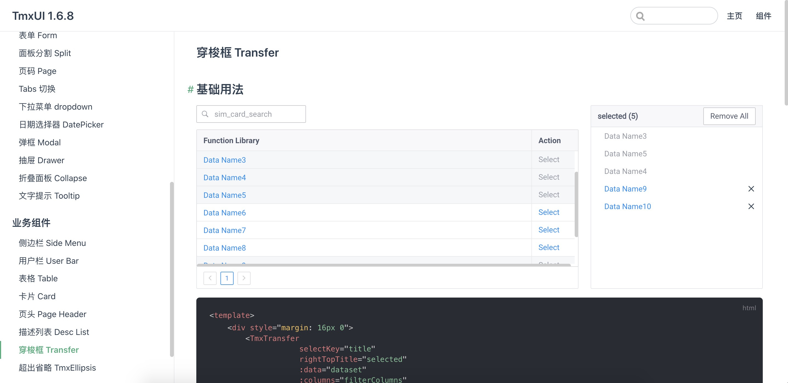

# 关于 TMX UI

tmx-ui 是 ThingsMatrix 的一个业务级的 UI 组件库

> 该项目为 ThingsMatrix 的前端业务组件库，旨在统一组件的 UI 样式，以及减少冗余的组件代码。该项目是基于 iView 4.0+版本进行二次开发。

# 特性

 

1. 抽离自项目中常用的业务组件
2. 独立的字体库和 iconfont 库
3. 支持全局引入和按需加载
4. 较完善的组件说明文档
5. 暂不支持 Vue 3
6. 持续维护和更新

# 预览

<el-carousel indicator-position="outside">
  <el-carousel-item v-for="item in ui" :key="item">
    
  </el-carousel-item>
</el-carousel>

# 地址
[https://thingsmatrix.github.io/tmx-ui/](https://thingsmatrix.github.io/tmx-ui/) 
