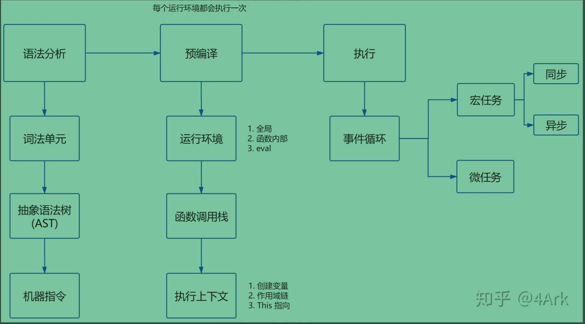

## JS解析与执行流程

[[toc]]
### Js是解释型预言
* 大家都知道JavaScript是解释型语言，既然是解释型语言，就是编译一行，执行一行，那预编译是在什么时候发生的呢？一般情况下是在script内代码块（如一个js文件）执行前和函数执行前。
* V8JS引擎是 边编译 边执行(即遇到一个代码块js文件或函数时，开始分析与预编译，然后执行)

### 相关概念：  
  1. 涉及的概念有：  
      1. 执行栈、执行上下文(如全局上下文、活动上下文(函数上下文))
      2. VO(变量对象) 和 AO(活动对象)
      3. 作用域链
      4. this机制等
          * 注意：this是执行上下文环境的一个属性，而不是某个变量对象的属性
      <!-- 详情见JS基础/基础原理《作用域与上下文》《上下文详解》《this》篇 -->

  2. 作用域 是什么？什么时候产生？
      * 作用域就是变量所能访问的范围，即变量对象
      * 开始预编译的时候创建一个作用域（即全局对象GO或函数对象VO）
      * 执行代码前，预编译的时候，分词、语法分析后，AST转机器码的过程

  3. 执行上下文： 是什么？什么时候产生？
      * 执行上下文 与 其他属性的关系，执行上下文包括如下属性：
        1. [[Scopes]]
        2. VO/AO
              1. arguments
              2. 函数声明
              3. 变量声明
        3. this
      * 创建执行上下文的过程就是在做这些事情：
          1. 创建变量对象
          2. 确定this的指向
          3. 作用域链确定
      * 代码执行前，预编译的时候，就是创建了一个执行上下文，并压入执行栈，压入后立即执行栈顶的执行上下文即此执行上下文

  4. 执行栈 
      * 浏览器js引擎会维护一个栈来执行代码
      * 先入后出模式，栈顶执行完成抛出后再抛下面的



#### 1. JS的解析阶段
  * JS是解释型预言，所以它无需提前编译，而是由解释器实时运行。

    JS引擎对JS解析过程，简介：
    1. 读取代码，进行词法分析(Lexical analysis)，将代码分解成词元(token)
    2. 对词元进行语法分析(parsing)，生成AST语法树(syntax tree)
    3. 使用解释器(translator)将代码转为字节码(bytecode)
    4. 使用字节码解释器(bytecode interpreter)，将字节码转为机器码
    最终计算机执行的就是机器码。
        <!-- https://juejin.cn/post/6971586506011967519 -->
  <!-- 
    JIT
      为了提高运行速度，现代浏览器一般采用即时编译（JIT-Just In Time compiler）
      即字节码只在运行时编译，用到哪一行就编译哪一行，并且把编译结果缓存（inline cache）
      这样整个程序的运行速度能得到显著提升。
      而且，不同浏览器策略可能还不同，有的浏览器就省略了字节码的翻译步骤，直接转为机器码（如chrome的v8）
      总结起来可以认为是： 核心的JIT编译器将源码编译成机器码运行 
  -->

#### 2. JS的预处理阶段(具体处理事情)
  在正式执行JS前，还会有一个预处理阶段 （譬如变量提升，分号补全等）也叫预解析
  * 分号补全  
    列举几条自动加分号的规则：
      1. 当有换行符（包括含有换行符的多行注释），并且下一个token没法跟前面的语法匹配时，会自动补分号。
      2. 当有}时，如果缺少分号，会补分号。
      3. 程序源代码结束时，如果缺少分号，会补分号。
    ```ts
    eg:
      function b() {
        return
        {
            a: 'a'
        };
      }
      结果是 undefined
    ```
  
  * 变量提升
    譬如可以提下变量声明，函数声明，形参，实参的优先级顺序，以及es6中let有关的临时死区等
    <!-- 详情可见《作用域与上下文》篇 -->

  * 自执行函数：定义和执行一起完成
    自执行函数定义的那个function在全局作用域下不进行预解析，当代码执行到这个位置的时候，定义和执行一起完成了。
    eg:
    ```ts
      (function (num) {
        console.log(num);
      })(100);
    补充：其他定义自执行函数的方式
      ~ function (num) {}(100)  
      + function (num) {}(100)  
      - function (num) {}(100)  
      ! function (num) {}(100)  
    ```
  
  * return下的代码依然会进行预解析
  ```ts
    function fn() {                             
      console.log(num); // -> undefined
      return function () {             
                                    
      };                               
      var num = 100;                   
    }                                  
    fn();  
  ```
  
  * 名字已经声明过了，不需要重新的声明，但是需要重新的赋值
  ```ts
    var fn = 13;                                       
    function fn() {                                    
        console.log('ok');                               
    }                                                  
    fn(); // Uncaught TypeError: fn is not a function  \
  ```
    <!-- https://www.jianshu.com/p/c3276ff58c93 -->

#### 3. JS的执行阶段
  1. 大体执行流程：
      1. 浏览器首次载入脚本，它会创建全局上下文glo_context，全局上下文有this===VO===global属性，将glo_context压入执行堆栈顶端；
      2. 继续执行，遇到函数执行，创建对应的函数上下文fn_context，
          1. 初始化函数上下文的作用域链(复制fn在创建即定义时就创建的fn.[[Scopes]]属性到fn_context.Scope上)，即fn_context.Scope = [glo_context.VO],
          2. 初始化函数上下文的变量对象fn_context.VO(主要属性有：参数、函数声明、变量声明),创建arguments对象，实例化arguments对象获得arguments参数，扫描函数体获得函数声明，继续扫描函数体获得变量声明，至此，变量对象准备完成；
          3. 确定上下文的fn_context.this；
        将fn_context，压入执行堆栈顶端；
      3. 将fn_context.VO变量对象压入作用域链顶端，即fn_context.VO添加到 fn_context.Scope 的前端(fn_context.Scope = [fn_context.VO,glo_context.VO]);
      4. 执行函数fn，激活fn_context.VO，边执行边给fn_context.VO对象的属性赋值，最终变成fn_context.AO；此时的作用域链是这样的(fn_context.Scope = [fn_context.AO,glo_context.VO]);
      5. 执行完毕fn，从执行栈弹出(弹出后会涉及垃圾回收机制来释放内存)，将执行权交给新栈顶，最后交回给glo_context，执行完毕，glo_context弹出，至此，主执行栈清空完毕
      <!-- 下面是事件循环机制的内容，可以去《事件循环机制》篇看 -->
      6. 主执行栈清空完毕，检查microtask队列，有任务压入主执行堆栈执行，直到microtask队列清空，检查macrotask队列进入下一个eventloop；
      7. 检查macrotask队列发现有任务，压入主执行堆栈执行，执行完一个，检查microtask队列，如此循环，直至所以队列清空。 
    
#### 4. 回收机制
  1. 标记清除
      常用：01标记法，遍历根对象，有用的标1，最后清除所以0标记的；
      优点：标记简单，占内存小
      缺点：内存碎片化 、 分配速率低、 需每隔一段时间去遍历根对象，阻塞JS的执行
      V8 GC有优化：分代式优化，新老代区别对待
  2. 引用清除
      很少用了：引用类型，有引用的引用计数加1，为0的清除，
      优点：引用时就标记了，不用遍历
      缺点：循环引用问题(需要手动清除循环的对象)，维护一个计数器占内存
  <!-- 详情见《浏览器底层知识/JS引擎原理/垃圾回收及内存泄漏》篇 -->


### JS执行过程详解总结：（在ES3中，执行上下文包含三个部分: [参考文章：https://cloud.tencent.com/developer/article/1534786]）
  1. 分析阶段
      * 代码分析：词法分析 -> 语法分析 -> AST语法树 -> 机器指令
      1. 词法分析：将代码分析成词元token数组   
      2. 语法分析：将词元分析成AST语法树，并进行代码检查，如果有错误报错

      * AST语法树 -> 机器指令的过程 中进行了预编译

  2. 预编译阶段
      * 预编译做了下面一件事情，即根据运行环境创建执行上下文(全局、函数、eval)，并压入执行栈
      * 创建执行上下文做了下面几件事情：
          1. 变量对象(GO\VO\AO,即作用域) 的创建
              1. 创建变量对象(即GO\VO\AO:全局对象\变量对象\活动对象)
              2. 形参 Arguments 对象初始化(如果是函数)， 
              3. 形参和实参值统一(如果是函数，此时没执行代码，只是参数赋值，)
              4. 函数 申明，即往GO上添加属性，如果已有相同变量或函数申明了，替换申明的变量为此函数(注意函数表达式其实也是变量申明，只有函数式申明才有此过程)
              5. 变量 申明，即往GO上添加属性，如果变量或函数或形参已申明，跳过此var变量申明

              * (全局环境叫GO，可被js访问)
              * (函数环境初始化叫VO、执行时被赋值激活叫AO，不可被js访问)
              <!-- 参考文章：https://juejin.cn/post/6844904046378090504 -->
              <!-- 参考文章：https://juejin.cn/post/6917925151317164045 -->
              <!-- 参考文章：https://cloud.tencent.com/developer/article/1534786 深入理解变量对象、作用域链和闭包-->

          2. this 的值确定
              * this是执行上下文的一个属性，不是变量对象的属性
              1. 在全局环境下，this指向window或其他系统环境的global
              2. 在函数环境下，this指向调用该函数对象(即this由调用者决定，可能是某个对象，或window或严格模式下是undefined)

          3. 作用域链 的创建
              1. 当函数被创建的时候，将当前环境的作用域链保存到函数的[[scope]]属性上
              2. 当创建执行上下文的时候，创建作用域链属性Scope，复制[[scope]]的值到Scope上(即执行上下文创建一个Scope属性，存放的是函数定义时的作用域链)
              3. 将当前执行上下文的变量对象作用域VO压入Scope栈顶

  3. 执行阶段
      * 此时AST语法树已经转为机器码
      * 执行指针指向执行栈顶，执行栈顶的执行上下文
      1. 开始执行执行栈顶的执行上下文的机器码，边执行边给变量对象属性赋值，当遇到函数时，为函数创建[[scope]]属性
      2. 当执行到函数时，进行代码分析，创建函数执行上下文，压入执行栈，执行指针指向栈顶，执行函数执行上下文
      3. 当执行函数执行上下文时，将当前变量对象压入作用域Scope栈顶，边执行边给变量对象属性赋值，赋值查找过程是Scope顺序查找，变量对象被激活成为活动对象

  * 以上都是ES3的流程，，执行上下文包含三个部分:
      1. scope: 作用域，也常常被叫做作用域链。
      2. variable object:变量对象，用于存储变量的对象。
      3. this value: this值。

  #### 简单总结：
    js代码的执行是一块一块执行的，边编译边执行的，先代码分析，然后预编译生成执行上下文压入执行栈，开始执行代码；创建执行上下文包括创建变量对象、this指向确定、创建作用域链。

### JS执行过程详解总结：（在ES3中，执行上下文包含三个部分）
  * 在ES5中，我们改进了命名方式，把执行上下文最初的三个部分改为下面这个样子:
    1. lexical environment:词法环境，当获取变量时使用。
    2. variable environment:变量环境，当声明变量时使用。
    3. this value: this值。   

### JS执行过程详解总结：（在ES2018，执行上下文包含两个部分：[参考文章：https://chorer.github.io/2019/04/08/]）
  1. 分析阶段(与ES3一致)
  2. 预编译阶段(创建执行上下文)
      1. 词法环境 创建
          1. 环境记录：存储变量和函数的实际位置
              1. 主要记录let、const和函数等，未分配前let和const的值是 < uninitialized >的；
              2. 如果是全局环境，有window对象相关的；如果是函数环境，有arguments对象相关的；
          2. 对外部环境引用：可访问其他外部词法环境
              1. 如果是window环境，outer: < null >  ；
              2. 如果是函数环境，outer: < GlobalLexicalEnvironment />等
          3. this绑定：确定this的指向
              * this指向其调用者
      2. 变量环境 创建(同词法环境类似，只是处理var)
          1. 环境记录：存储变量的实际位置
              1.  主要记录var，未分配前var是 undefined的；
          2. 对外部环境引用：可访问其他外部词法环境
          3. this绑定：确定this的指向 
  3. 执行阶段：边执行，边完成对上面环境记录的变量分配

  * 以上是在ES2018中，this值被归入lexical environment,同时增加了不少内容：
    1. lexical environment:词法环境，当获取变量或者this值时使用。
    2. variable environment:变量环境，当声明变量时使用。
  <!-- 参考文章：https://cloud.tencent.com/developer/article/1534786 -->
  <!-- 参考文章：https://chorer.github.io/2019/04/08/F-%E6%B7%B1%E5%85%A5%E7%90%86%E8%A7%A3%E6%89%A7%E8%A1%8C%E4%B8%8A%E4%B8%8B%E6%96%87%E5%92%8C%E6%89%A7%E8%A1%8C%E6%A0%88/#4-%E5%86%8D%E7%9C%8B%E5%8F%98%E9%87%8F%E6%8F%90%E5%8D%87 -->


### 总结：
  此篇只涉及JS的解析与执行的流程，不涉及JS的垃圾回收机制、EventLoop事件循环机制等，总流程可参考
  [《浏览器底层知识/JS引擎原理/JS解析与执行/JS解析与执行总流程.md》篇](../../../浏览器/JS引擎原理/JS解析与执行/JS解析与执行总流程.md)，该篇从JS加载，到解析，到执行，到垃圾回收，到事件循环等