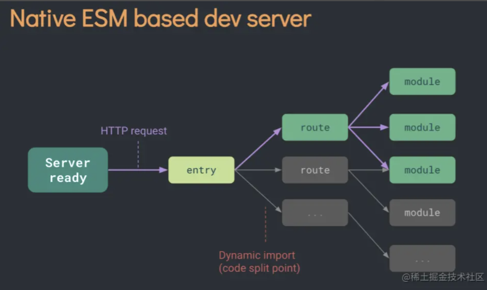

### Vite
  1. 基于esbuild和rollup实现，内部使用esmodule进行解析，不需要编译，所以比Webpack快很多，并且esbuild基于go实现，有语音优势；
      * 核心原理是浏览器支持ESM语法

  2. vite vs webpack
      1. webpack无论是生成还是开发都需要将整个项目的依赖关系确认好，然后打包输出bundles才能被浏览器使用；热更新也是要重新打包，导致项目更新缓慢；
      2. vite基于esm不用，浏览器解析遇到import才发起http请求加载对应文件，vite服务器拦截请求，处理文件数据，返回esm给浏览器，做到了真正的按需加载；
      3. 原理上来说就是：webpack会将代码转为cjs再转为es5才能被浏览器使用，而vite是将代码转换为esm，直接esm的按需加载

  3. 两种方式：
      1. 开发环境：esm + esbuild
          * esbuild将代码转为esm，但不支持css和代码分割
          * esbuild可以预编译，将cjs转为esm
          * Esbuild 则选择使用 Go 语言编写，该语言可以编译为原生代码,在编译的时候都将语言转为机器语言，在启动的时候直接执行即可，在 CPU 密集场景下，Go 更具性能优势。

      2. 生成环境：rollup
          * 生成环境的代码需要打包，不打包网络请求缓慢，需要都代码进行tree-shaking、分割、压缩
          * rollup成熟打包环境
        ::: tip
          尽管原生 ESM 现在得到了广泛支持，但由于嵌套导入会导致额外的网络往返，
          在生产环境中发布未打包的 ESM 仍然效率低下（即使使用 HTTP/2）。
          为了在生产环境中获得最佳的加载性能，最好还是将代码进行 tree-shaking、懒加载和 chunk 分割（以获得更好的缓存）。
        ::: 

  4. 而Vite利用浏览器对ESM的支持，当 import 模块时，浏览器就会下载被导入的模块。先启动开发服务器，当代码执行到模块加载时再请求对应模块的文件,本质上实现了动态加载。灰色部分是暂时没有用到的路由，所有这部分不会参与构建过程。随着项目里的应用越来越多，增加route，也不会影响其构建速度。
  

  [链接：Vite详解](https://juejin.cn/post/7064853960636989454)
  
  [Vite 知识点和迁移方案](https://juejin.cn/post/6988704825450397709#heading-15)
