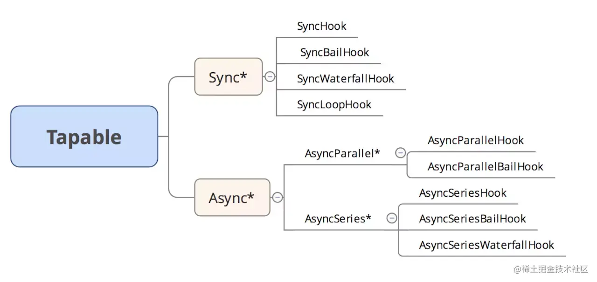
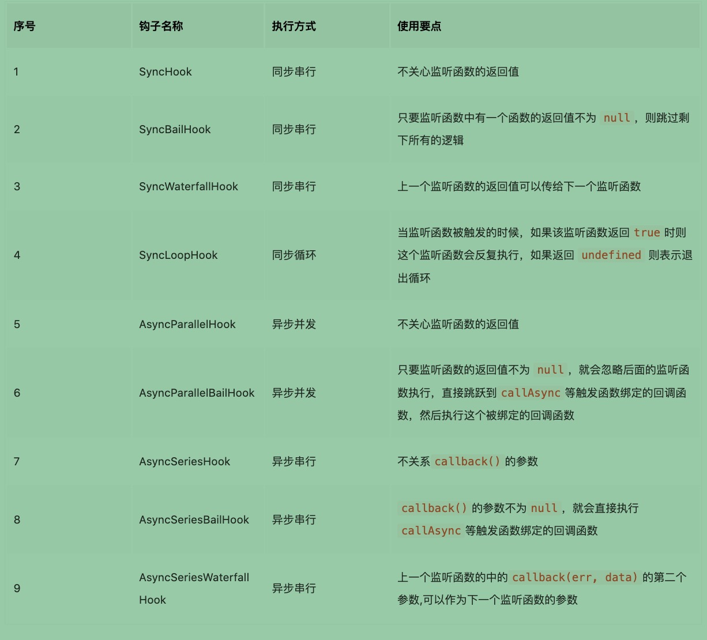

### Tapable
  <!-- 参考文章：https:juejin.cn/post/7040982789650382855 -->
  1. 缘由：
      1. Webpack 在前端工程化中可谓是大名鼎鼎，在Webpack编译过程中存在两个核心对象。
        1. 负责整体编译流程的 Compiler 对象。
        2. 负责编译 Module 的 Compilation 对象。
      在 Webpack 的世界中，围绕着两个配套的生态 Loader 以及 Plugin 两种机制。
      
      2. 在 Webpack 的编译过程中，本质上通过 Tapable 实现了在编译过程中的一种发布订阅者模式的插件 Plugin 机制。
      Plugin 的本质上基于 Tapable 这个库去实现的。

  2. 介绍： 
    Tapable 提供了一系列事件的发布订阅 API ，通过 Tapable我们可以注册事件，从而在不同时机去触发注册的事件进行执行。
    Webpack 中的 Plugin 机制正是基于这种机制实现在不同编译阶段调用不同的插件从而影响编译结果。

  3. Tapable 官方文档提供了这九种钩子：
  ```ts
      const {
        <!--  同步串行	不关心监听函数的返回值 -->
        SyncHook, 

        <!--  同步串行	只要监听函数中有一个函数的返回值不为 null，则跳过剩下所有的逻辑 -->
        SyncBailHook, 

        <!--  同步串行(瀑布钩子)	上一个监听函数的返回值可以传给下一个监听函数
        * 需要额外注意的是当存在多个参数时，通过 SyncWaterfallHook 仅能修改第一个参数的返回值。 -->
        SyncWaterfallHook, 

        <!--  同步循环	当监听函数被触发的时候，如果该监听函数返回true时则这个监听函数会反复执行，如果返回undefined 则表示退出循环 -->
        SyncLoopHook, 

        <!-- 	异步并发	不关心监听函数的返回值 -->
        AsyncParallelHook, 

        <!--  异步并发	只要监听函数的返回值不为 null，就会忽略后面的监听函数执行，直接跳跃到callAsync等触发函数绑定的回调函数，然后执行这个被绑定的回调函数 -->
        <!-- 中断后会立即调用总回调函数，但是由于是异步事件，所有注册事件在开始就执行了，各自的回调函数已经加入事件队列，虽然中断了，但是事件队列还是会执行的，所有异步并发熔断钩子其实并没有实际效果。 -->
        AsyncParallelBailHook, 

        <!--  异步串行	不关系callback()的参数 -->
        <!-- 
          tapAsync 注册时实参结尾额外接受一个 callback ，调用 callback 表示本次事件执行完毕。
            callback 的机制和 node 中是一致的，也就是说 callback 函数调用时，如果第一个参数表示错误对象，如果传递第一个参数的话那么就表示本次执行出现错误会中断执行。
          当然后续参数和 nodejs 中同理，从 callback 函数第二个参数表示开始表示本次函数调用的返回值。 
        -->
        AsyncSeriesHook,

        <!--  异步串行	callback()的参数不为null，就会直接执行callAsync等触发函数绑定的回调函数 -->
        AsyncSeriesBailHook, 

        <!--  异步串行	上一个监听函数的中的callback(err, data)的第二个参数,可以作为下一个监听函数的参数 -->
        AsyncSeriesWaterfallHook 

      } = require("tapable");
  ```
  
  

  4. 根据执行机制，钩子的类型大体分为四种：
      1. 基础类型：
          Basic Hook : 基本类型的钩子，它仅仅执行钩子注册的事件，并不关心每个被调用的事件函数返回值如何。

      2. 瀑布类型：
          Waterfall : 瀑布类型的钩子，瀑布类型的钩子和基本类型的钩子基本类似，唯一不同的是瀑布类型的钩子会在注册的事件执行时将事件函数执行非 undefined 的返回值传递给接下来的事件函数作为参数。

      3. 熔断类型：
          Bail : 保险类型钩子，保险类型钩子在基础类型钩子上增加了一种保险机制，如果任意一个注册函数执行返回非 undefined 的值，那么整个钩子执行过程会立即中断，之后注册事件函数就不会被调用了。

      4. 循环类型：
          Loop : 循环类型钩子，循环类型钩子稍微比较复杂一点。循环类型钩子通过 call 调用时，如果任意一个注册的事件函数返回值非 undefeind ,那么会立即重头开始重新执行所有的注册事件函数，直到所有被注册的事件函数都返回 undefined。

  5. 拦截器：
        Tapable 提供的所有 Hook 都支持注入 Interception ，它和 Axios 中的拦截器的效果非常类似。
        我们可以通过拦截器对整个 Tapable 发布/订阅流程进行监听，从而触发对应的逻辑。
        ```ts
        const hook = new SyncHook(['arg1', 'arg2', 'arg3']);
        hook.intercept({
          // 每次调用 hook 实例的 tap() 方法注册回调函数时, 都会调用该方法,
          // 并且接受 tap 作为参数, 还可以对 tap 进行修改;
          register: (tapInfo) => {
            console.log(`${tapInfo.name} is doing its job`);
            return tapInfo; // may return a new tapInfo object
          },
          // 通过hook实例对象上的call方法时候触发拦截器
          call: (arg1, arg2, arg3) => {
            console.log('Starting to calculate routes');
          },
          // 在调用被注册的每一个事件函数之前执行
          tap: (tap) => {
            console.log(tap, 'tap');
          },
          // loop类型钩子中 每个事件函数被调用前触发该拦截器方法
          loop: (...args) => {
            console.log(args, 'loop');
          },
        });
        ```

        1. register: 每次通过 tap、tapAsync、tapPromise 方法注册事件函数时，会触发 register 拦截器。这个拦截器中接受注册的 
        2. Tap 作为参数，同时可以对于注册的事件进行修改。
        3. call: 通过调用 hook 实例对象的 call 方法时执行。（包括 callAsync, promise）接受的参数为调用 Hook 时传入的参数。
        4. tap: 在每一个被注册的事件函数调用之前执行，接受参数为对应的 Tap 对象。
        5. loop: loop类型钩子中 每次重新开始 loop 之前会执行该拦截器，拦截器函数接受的参数为调用时传入的参数。

  6. Before && stage
      Tapable 在注册事件函数时，第一个参数同时支持传入一个对象。
      我们可以通过这个对象上的 stage 和 before 属性来控制本次注册的事件函数执行时机。
      1. Before 属性
        before 属性的值可以传入一个数组或者字符串,值为注册事件对象时的名称，它可以修改当前事件函数在传入的事件名称对应的函数之前进行执行。
        ```ts
          const { SyncHook } = require('tapable');
          const hooks = new SyncHook();
          hooks.tap(
            {
              name: 'flag1',
            },
            () => {
              console.log('This is flag1 function.');
            }
          );

          hooks.tap(
            {
              name: 'flag2',
              // flag2 事件函数会在flag1之前进行执行
              before: 'flag1',
            },
            () => {
              console.log('This is flag2 function.');
            }
          );

          hooks.call();

          // result
          This is flag2 function.
          This is flag1 function.
      ```

      2. stage 属性
        stage 这个属性的类型是数字，数字越大事件回调执行的越晚，支持传入负数，不传时默认为0.
        ```ts      
        const { SyncHook } = require('tapable');
          const hooks = new SyncHook();
          hooks.tap(
            {
              name: 'flag1',
              stage: 1,
            },
            () => {
              console.log('This is flag1 function.');
            }
          );
          hooks.tap(
            {
              name: 'flag2',
              // 默认为stage: 0,
            },
            () => {
              console.log('This is flag2 function.');
            }
          );
          hooks.call();
          // result
          This is flag2 function.
          This is flag1 function.
        ```

  7. HookMap
      HookMap 本质上就是一个辅助类，通过 HookMap 我们可以更好的管理 Hook ：
      ```ts
        const { HookMap, SyncHook } = require('tapable');
        // 创建HookMap实例
        const keyedHook = new HookMap((key) => new SyncHook(['arg']));

        // 在keyedHook中创建一个name为key1的hook，同时为该hook通过tap注册事件 
        keyedHook.for('key1').tap('Plugin 1', (arg) => {
          console.log('Plugin 1', arg);
        });

        // 在keyedHook中创建一个name为key2的hook，同时为该hook通过tap注册事件
        keyedHook.for('key2').tap('Plugin 2', (arg) => {
          console.log('Plugin 2', arg);
        });

        // 在keyedHook中创建一个name为key1的hook，同时为该hook通过tap注册事件
        keyedHook.for('key3').tap('Plugin 3', (arg) => {
          console.log('Plugin 3', arg);
        });

        // 从HookMap中拿到name为key1的hook
        const hook = keyedHook.get('key1');

        if (hook) {
          // 通过call方法触发Hook
          hook.call('hello');
        }
      ```

  8. Tapable 基本用法
      1. 实例Hook new Sync* / new Async*
      2. 注册事件 tap
      3. 发布Hook call

      * 注册与发布
          1. 同步：tap/callAsync
          2. 异步：tap/call tapAsync/callAsync tapPromise/callPromise

  9. Tapable原理：
      1. 简要：
        Tapable 所做的事件就是根据 Hook 中对应的内容动态编译上述的函数体以及创建 Hook 实例对象。
        最终在我们通过 Call 调用时，相当于执行这段代码：
        ```ts
          // fn 为我们上述动态生成最终需要执行的fn函数
          // hook 为我们上边 tapable 内部创建的hook实例对象
          hook.call = fn
          hook.call(arg1, arg2)
        ```
        Tapable 源码中的核心正是围绕生成这两部分内容（一个是动态生成的 fn 、 一个是调用fn的 hook 实例对象）。
        * 源码中分别存在两个 class 去管理这两块的内容：
          1. Hook 类，负责创建管理上边的 hook 实例对象。下文简称这个对象为核心hook实例对象。
          2. HookCodeFactory 类，负责根据内容编译最终需要通过 hook 调用的 函数 fn 。下文简称这个函数为最终生成的执行函数。

      2. 详细：
        后面有空研究
        [参考文章：Table详解](https://juejin.cn/post/7040982789650382855#heading-24)


