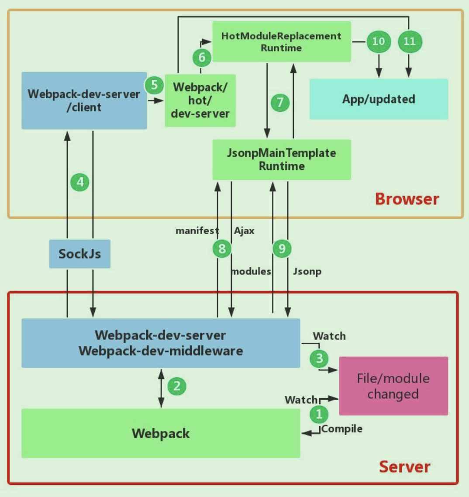

### HMR 模块热替换
  1. 概述:
    * 模块热替换（Hot Module Replacement 或 HMR）是 webpack 提供的最有用的功能之一, 会在应用程序运行过程中替换、添加或删除模块，而无需重新加载整个页面。
    <!-- 一般如果我们使用了 webpack-dev-server，当我们修改了项目中的文件的时候，一般会重新刷新一下页面，这会导致我们刚刚在页面中操作的东西都被还原。 -->

  2. 配置：
    <!-- 
      devServer: {
        port: 8888,  // 自定义端口号
        open: true,   // 自动打开浏览器窗口
        hot: true, // 开启热更新
        hotOnly: true
      }, 
    -->
    
  3. 使用：
      1. js文件：
        需要在js代码中响应：
          <!-- 
            if(module.hot){
              module.hot.accept('文件路径',()=>{
                监听到文件修改后做点什么...
              })
            } 
          -->

      2. less样式文件：
        * 直接修改文件里的样式，页面会自动更新为最新样式.
        * 为啥？
          因为 css-loader 默认已经帮我们做了这一件事情了

      3. 同样react、vue框架的文件同样是内部实现了监听逻辑

  4. 原理：
      开启webpack-dev-server热更新模式的服务器时，大概有两个工作流程：
        1. 初次流程： <!--图解流程是： 1->2->A->B -->
          * webpack通过webpack compiler编译器，将文件系统file system的文件进行打包，输出到bundle server服务器上，最后将bundle.js发送给浏览器
         
        2. 更新流程：<!--图解流程是： 1->2->3->4->5 -->
          * 当文件系统的文件发生变化时，webpack重新打包，将更新后的代码发送给 服务端HMR Server，HMR server通知 浏览器HMR runtime(一般热更新文件以json的形式传给 浏览器HMR runtime)，HMR runtime来决定是否更新文件代码。 

        3. 具体流程：<!-- (图片对应 HMR原理流程图.png) -->
            1. webpack-dev-server插件初始化，同时启动本地服务，开启(webpack-dev-server\server与webpack-dev-server\client)的websocket长连接
            2. 通过webpack-dev-middleware这个插件调用webpack的API，来监听文件系统里的文件的变化的，并修改webpack输出目录(把输出文件保存到内存Bundle Server中)，当文件变化通知webpack compiler重新打包，
                <!-- webpack-dev-server 是将打包的代码放到内存之中，不是在 output 指定的目录之下，这样能使 webpack 速度更快。 -->
            3. webpack compiler重新打包后，HMR server(即webpack-dev-server\server)，将变化的文件内容的hash值，通过sockJs 发送给HMR client(即webpack-dev-server\client)，HMR client将hash值交回给bundle.js(webpack打包后的bundle.js文件有webpack的代码，即HMR runtime，下面称为HMR runtime)
            4. HMR runtime收到hash后，会根据配置的hot来决定是浏览器reload还是更新文件，
            5. 如果更新，则HMR runtime拿hash值以Ajax的形式发送回给Bundle server，Bundle server收到后返回所有需要更新的模块的hash数组，HMR runtime再拿这些hash数组以jsonp的形式去Bundle server获取需要更新的代码文件(返回json数据)
                <!-- jsonp的形式就是让webpack拿到返回的json数据后，可以直接执行webpack代码里定义好的逻辑函数 -->
            6. HMR runtime拿到返回的数据后，比对数据看是否需要更新，需要更新则检查相关依赖模块关系，更新依赖关系，达到更新页面的效果
            7. 如果更新失败，则强制reload来刷新页面代码
            

        4. 源码流程：<!-- (图片对应 HMR原理流程详图.png) -->
            1. 第一步，根据devServe的配置，在npm start之后，通过webpack-dev-server开启本地服务并进入webpack的watch模式下，然后初始化webpack-dev-middleware来监听文件系统的变化；同时修改webpack配置中的entry属性，最终将webpack-dev-server/client的代码写入到bundle.js文件中；webpack-dev-server通过sockjs在浏览器端bundle.js和服务端之间建立一个 websocket 长连接；
              <!-- (webpack-dev-middleware 调用 webpack 暴露的 API对代码变化进行监控)； -->
              <!-- webpack-dev-server/client的代码有sockjs代码，这样bundle.js就能跟webpack-dev-server\lib\Server.js服务通讯了 -->
            2. 第二步, 文件系统中某一个文件发生修改，webpack 监听到文件变化，webpack件对模块重新编译打包，并将打包后的代码作为一个对象保存到内存中；
              <!-- (因为访问内存中的代码比访问文件系统中的文件快，实现原理是webpack-dev-middleware通过memory-fs依赖库修改了webpack的compiler编译器，将原本 outputFileSystem  替换成了 MemoryFileSystem 的实例)； -->
              <!-- 这样 bundle.js 文件代码就作为一个简单 JavaScript 对象保存在内存中，当浏览器请求 bundle.js 文件时，devServer 就直接去内存中找到上面保存的 JavaScript 对象并返回给浏览器端； -->
            3. 第三步, webpack-dev-server 对文件变化的一个监控，这一步不同于第一步，并不是监控代码变化重新打包。当我们在配置文件中配置了devServer.watchContentBase 为 true 的时候，Server 会监听这些配置文件夹中静态文件的变化，变化后会通知浏览器端对应用进行 live reload；
              <!-- 注意，这儿是浏览器刷新，和 HMR 是两个概念。 -->
            4. 第四步, 当监听到文件变化，重新webpack compiler编译打包后，通过 HMR Server(即服务端webpack-dev-server的一部分)将文件hash值告知浏览器端，同时也包括第三步中 Server 监听静态文件变化的信息；浏览器端webpack-dev-server/client拿到hash值缓存起来，等待再推来ok状态后，才将hash值交给bundleJs(webpack)；
              <!-- webpack-dev-server 调用 webpack api 监听 compile的 done 事件,即compiler编译打包完成 -->
            5. 第五步, 通过bundleJs里 webpack/hot/dev-server监听到hash，调用webpack/lib/HotModuleReplacement.runtime(简称 HMR runtime)来检查是否更新；
              <!-- 在 check 过程中会利用 webpack/lib/JsonpMainTemplate.runtime（简称 jsonp runtime）中的两个方法 hotDownloadManifest 和 hotDownloadUpdateChunk，第一个方法是调用 AJAX 向服务端请求是否有更新的文件，如果有将发更新的文件列表返回浏览器端；第二个方法是通过 jsonp 请求最新的模块代码，然后将代码返回给 HMR runtime，HMR runtime 会根据返回的新模块代码做进一步处理，可能是刷新页面，也可能是对模块进行热更新； -->
              <!-- 当然如果仅仅是刷新浏览器，也就没有后面那些步骤了 -->
            6. 第六步，如果是热更新，HMR runtime中的 HotModulePlugin 将会对新旧模块进行对比，决定是否更新模块，在决定更新模块后，检查模块之间的依赖关系，更新模块的同时更新模块间的依赖引用。
              <!-- 通过 HMR runtime 的 hotApply 方法，找出并移除过期模块和相关依赖，modules增加新模块代码，当下次调用 __webpack_require__  (webpack 重写的 require  方法)方法的时候，就是获取到了新的模块代码了。 -->
            8. 最后一步，当 HMR 失败后，回退到 live reload 操作，也就是进行浏览器刷新来获取最新打包代码。

        5. 主要概念 及 工作内容：
            1. File System：
              文件系统，即本地编写的代码及使用到的资源

            2. Webpack-dev-server：
              1. webpack启动本地服务的插件，在初始化的时候通过express启动一个本地服务
              2. 同时修改entry配置，在浏览器端bundleJs添加sockjs代码，同时建立两端长连接sock.js
              3. 通过webpack-dev-middleware中间件调用webpack的API，来监听文件系统
              
            3. webpack
              1. 监听静态资源的变化，更新，直接reload；
              2. 监听动态文件的变化，webpack.complier重新编译；
              3. 编译后交给 Webpack-dev-server；
              4. 浏览器端打包了webpack代码(bundleJs),通过webpack/hot/dev-server监听到hash变化，调用HMR runtime来判断是否更新和如何更新页面
              <!-- 
                * 最终判断更新和更新的操作还是webpack来完成的，webpack-dev-server只不过是建立了桥梁充当中间人角色。 
              -->
            
            4. webpack-dev-middleware
                可以操作webpack API

  5. [参考文章：xx](https://juejin.cn/post/6844904193136787470 )

