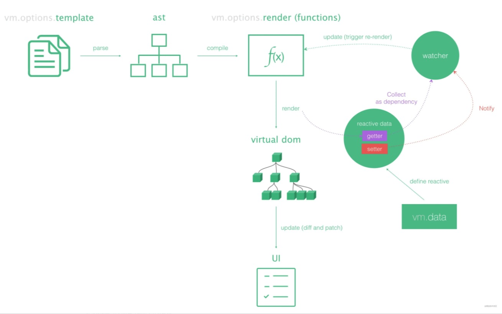

### Vue.js 是一个典型的 MVVM 框架，核心思想是数据驱动和组件化。

- DOM 是数据的一种自然映射，在 Vue 中只需要修改数据即可达到 DOM 更新的目的。组件化是将页面上每一个独立的功能块或者交互模块视作一个组件，把页面看做是容器，从而实现搭积木式的开发方式。 把源码 download 到本地我们看下目录结构

#### Vue 源码目录分工明确。整个目录大致分为

    * benchmarks:处理大量数据时测试Demo
    * dist:各环境所需的版本包
    * examples:用Vue实现的一些实用Demo
    * flow: 数据类型检测配置
    * packages: 特定环境运行需要单独安装的插件
    * src: 整个源码的核心。
    * script: npm脚本配置文件
    * test: 测试用例
    * types: 新版typescript配置

#### 整体流程：

1. Vue 初始化，参数处理，数据劫持，vm 挂载
2. 首次渲染，执行 compileToFunctions()将模板 template 解析成 renderFn（render 函数）,如果 renderFn 已存在就跳过此部
   将 renderFn 通过 vm.\_render()编译成 Vnode，在读取其中变量的同时，Watcher 通过 Object.defindProperty()的 get 方法收集依赖到 dep,开始监听
3. 执行 vm.\_update()，首先到 vdom 的 patch()方法会将 vnode 渲染成真实 DOM
4. 将 DOM 挂载到节点上，等待 data 发生改变
5. data 属性发生变化，首先查看收集的依赖中是否存在该 data 值的引用，不存在就不管，存在则触发 Object.defindProperty()的 set 方法修改值并且执行 updataComponent()进行组件更新

核心代码都在 src 目录下，其中包含实例化、数据响应式处理、模板编译、事件中心、全局配置等等都在这个目录下。

  <!-- 此列参考链接：https://juejin.cn/post/6844903650607759367 -->

#### Vue 架构分析：

1. csr 渲染(客户端渲染)
1. 运行时
1. 入口： entry-runtime.js
1. 编译器+运行时
1. 入口： entry-runtime-with-compiler.js
1. 引入 Vue.js ----->(////'core/index')
1. 定义 Vue() => {this.\_init(options)} ----->(////'./instance/index')
1. 往 Vue.prototype 原型上挂载属性和方法(initMixin...) ----->(////'./instance/index')
   (\_init\$data $props $watch $set $delete\$on $once $off $emit\_update 和 $forceUpdate $destroy\_render 和 $nextTick 、$isServer、$ssrContext)
1. 往 Vue 上挂载属性和方法(initGlobalAPI) ----->(////'./global-api/index')
   (nextTick、set、del、use、extend、component、directive、filter\options.components ...)
1. 往 Vue 的原型对象上挂载一下平台 platform 相关的方法，比如(dom 操作方法 patch、dom 属性操作方法、全局指令、全局组件、Vue.prototype.$mount) ----->(////'./runtime/index')
1. 根据 core/config.js 核心配置配置文件，根据环境变量开起开发者工具等； ----->(////'./runtime/index')
1. 重写了 Vue.prototype.$mount(相比 entry-runtime.js 多了一些 template 的转换) ----->(////'entry-runtime-with-compiler.js')
1. 通过 compileToFunctions 将 template 转为对应的 render、staticRenderFns 函数
1. 编译完成后，返回 render 函数挂载到 this.$options 上，后面的代码就是运行时的代码一样的了
1. new Vue() ，根据 options，初始化 Vue，完了挂载 Vue 实例....后面走的就是渲染流程了。

1. ssr 渲染(服务端渲染)
1. 还没有研究，后面有空研究下.......???

#### 运行时 VS 编译器+运行时

- vue.js 完整版 compile+time 与运行时版 runtime 的区别? https://zhuanlan.zhihu.com/p/102565974
  - 在初次使用 vue.js 时，可以看到官方提供了两个版本可以使用，包括 vue.js（完整版）和 vue.runtime.js（运行时版）。在实际环境中，应当使用运行时版，这是由于 vue.runtime.js 体积更小，在用户网络情况不好时能更快地加载。下面更具体地说明 vue.js 和 vue.runtime.js 的区别。

1. vue.js : 编译器+运行时，可识别 template 里的模板 \*在浏览器上编译，后可运行。
   我们知道，vue.js 提供了一套模版，使我们能使用 v-if, v-for 之类的语法来编写 html。但是浏览器并不认识 v-if、v-for 之类的模版，需要通过一个模版编译器将这样的模版转换为浏览器认识的 html。所以 vue.js 的渲染逻辑是将模版字符串转换为 html 字符串，在将 html 字符串插入到页面的 html 中实现渲染。
   new Vue({
   el: "#app", // 模版字符串插入的位置
   template: `
{{ value }}
`, // 模版字符串
   data: {
   value: 0
   }, // 替换的数据，即{{ value }} 被替换为 0
   })

2. vue.runtime.js: 运行时，识别 render;template 模板在项目打包时交给 vue-loader 等第三方插件去处理 \*可直接在浏览器上运行。
   vue.runtime.js 不包含模版编译器来获得整个包体积的减少。
   显然，如果没有模版编译器，上面代码中的模版字符串就没有办法转化为原始的 html 字符串。但是与其将模版字符串在用户端编译，为何不在开发时本地编译好了再发送给用户呢？这样做就节省了 vue.js 中模版编译器所需要的体积。
   new Vue({
   el: "#app",
   data: {
   value: 0
   },
   render(h) {
   return h('div', this.n)
   },
   })
   h 就是 vue.runtime.js 提供的函数，它接收模版字符串中的参数，返回渲染好的原始的 html。
   在实际开发中，由于 h 函数的参数比较复杂，实际开发中通过使用 webpack 的 vue-loader 插件能将 vue 单文件组件（以.vue 结尾的文件）转换为 h 函数所需要的参数。

https://juejin.cn/post/6844903936239861768 Vue 之 运行时 vs 编译器+运行时（深入源码）

3. 总结：
   简单来说，编译时+运行时 与 运行时 的区别是：
   编译时+运行时：打包后代码比较大，在浏览器端运行项目时会运行编译函数编译模板；  
    好处是：可以在 template 写 html 模板，不用写 render 函数。
   运行时：打包的时候就进行了代码的编译，打包后的项目浏览器能直接识别运行。  
    好处是：体积小，浏览器压力小，但是要写 render 函数，结构复杂时比较难写和维护。

4. 延伸：

   1. 加载 json 数据

   - 使用 axios 根据相对路径读取
     同理使用 axios 加载本地 json 也会遇到同样问题，如在 assets 下面我们放一个 json，然在组件读取
     由于 axios 是异步的，所以在编译时未运行，编译后的路径就是相对路径，但是编译后的输出目录路径改变了，所以也是找不到的。
     解决方案是：
     新增一个 vue.config.js 同样添加 copy-webpack-plugin
     将 json 文件拷贝到指定的输出目录文件夹下

   2. 在项目开发中，会发现有时候开发时资源引用路径是没问题的，打包上线后会找不到。
      <!-- https://blog.csdn.net/qq_34817440/article/details/104016977 -->

      1. 这里的理解可能有点错误
         其实是两个问题？

         1. 是在开发中使用 src="../image/logn.png"这种方法引用图片没问题，线上有问题；
         2. 是在开发中使用 src="imgUrl"，imgUrl:'../image/logn.png',有问题,线上也有问题

      2. 这些涉及到 1. 开发时如何打包的？ 2. 生产时如何打包的？ 3. 项目在编译时会不会把对应资源加载到输出文件夹？ 4. 如果会编译后的 src 引用路径是否会改变？
      下次解答
      <!-- eg：
        在vue项目中，图片引用，src="../image/logn.png"，这时是直接映射图片地址，所以在编译期是会将资源打包进输出文件夹，所以图片正常展示
        在vue项目中，图片引用，src="imgUrl"，imgUrl:'../image/logn.png'在data中定义，这时在编译期是不会将资源打包进输出文件夹，所以找不到图片404了
      解决方案是：
        使用静态目录加载img
        即在输出项目中指定一个public的静态资源目录，通过webpack的配置将所有图片都打包进这个目录 -->

### Vue 的三大核心模块：

1. Reactivity Module 响应式模块
   响应式模块允许我们创建 JavaScript 响应对象并可以观察其变化。当使用这些对象的代码运行时，它们会被跟踪，因此，它们可以在响应对象发生变化后运行。
2. Compiler Module 编译器模块
   编译器模块获取 HTML 模板并将它们编译成渲染函数。这可能在运行时在浏览器中发生，但在构建 Vue 项目时更常见。这样浏览器就可以只接收渲染函数。
3. Renderer Module 渲染模块
   渲染模块的代码包含在网页上渲染组件的三个不同阶段：
   渲染阶段
   在渲染阶段，将调用 render 函数，它返回一个虚拟 DOM 节点。
   挂载阶段
   在挂载阶段，使用虚拟 DOM 节点并调用 DOM API 来创建网页。  
    补丁阶段
   在补丁阶段，渲染器将旧的虚拟节点和新的虚拟节点进行比较并只更新网页变化的部分。

### Vue 运行时整体框架详解

1.  准备阶段：(丰富 Vue 构造函数)-根据不同平台(这里主要是 Web 平台)
    1. 往 Vue 构造函数添加公共属性和方法
       1. initGlobalAPI(Vue)：
       2. 添加 mergeOptions、defineReactive、添加 set、delete、nextTick、初始化 Vue.options 为空对象并添加 components={}、directives={}、filter={}等属性
       3. 添加内置组件内置组件、Vue.use 方法、Vue.mixin 方法、Vue.extend 方法、Vue.component(扩展自 Vue)、Vue.directive、Vue.filter 等
    2. 往 Vue 构造函数原型上添加公共属性和方法
       1. 主要方法有：
       2. initMixin：初始化相关的 init、
       3. stateMixin：数据处理相关的$data、$props、$watch、$set、$delete
       4. eventsMixin：事件操作相关的$on、$once、$off、$emit
       5. lifecycleMixin：生命周期相关的 更新视图\_update、强制更新$forceUpdate、销毁$destroy
       6. renderMixin：渲染相关的 渲染函数\_render、异步更新$nextTick
       7. 其他的：
       8. 全局静态配置：mustUseProp、isReservedTag、isReservedAttr...
       9. 内置指令和组件：directives、components
       10. 原型\__patch\__：patch 函数：将 vnode 转成真实 dom
       11. $mount：mountComponent 挂载函数
2.  实例化阶段：(实例化 Vue)-主要的就是\_init 初始化 Vue 或 VueComponent
3.  初始化阶段：(核心是数据响应式)-根据配置参数，初始化 Vue 实例，根 Vue 或组件的初始化都走这里
    1. 合并参数：mergeOptions：根 Vue 的参数合并 vm.$options = mergeOptions、组件的参数合并 initInternalComponent(vm, options)
    2. 代理实例：initProxy：可直接通过实例访问 data 的属性，vm.\_renderProxy = new Proxy(vm, handlers)
    3. 生命周期初始化：initLifecycle：确定组件的父子关系
    4. 事件初始化：initEvents：创建 vm 全局\_event 对象，用来存放事件；初始化父组件的 attach 事件
    5. 渲染函数初始化：initRender：往实例上挂$createElement、\_c = createElement()渲染函数，挂载槽相关的$slots 函数等
    6. 触发 beforeCreate 钩子：callHook(vm, 'beforeCreate')：这里主要可以回去$options 配置参数
    7. 注入初始化：initInjections：不重要
    8. 数据初始化：initState：初始化数据相关的属性，按顺序处理！！
       1. initProps：初始化 props，响应式处理 props 的属性，但不对 Object 或 Array 类型的值进行深度响应处理
          1. toggleObserving(false)取消深度响应
       2. initMethods：初始化 methods，将 methods 配置的属性都挂到 vm 上去
       3. initData：初始化 data，响应式处理 data 的属性，深度响应其 Object 或 Array 类型的值
          - 响应式系统：(核心部分)
            1. 为 data 实例化一个响应实例 ob，ob 有一个订阅器，用于收集所有读取 data 的 watcher 依赖；
            2. 开始劫持 data 的所有属性，为每个属性构造个订阅器 dep，用于收集读取该属性的 watcher 依赖；
            3. 判断其属性值如果是 Object、Array 类型的，对其值进行深度响应式处理，包括对对象的每个属性劫持，对数组的每个元素也劫持；
            4. 利用 Object.defineProperty 劫持属性，
               1. 当 get 读取属性时，往其订阅器添加当前的 watcher 依赖；如果该属性值是 Object 或 Array 类型的响应式的，那么为其值的订阅器添加当前的 watcher 依赖；如果值是数组，为其每个元素的订阅器添加当前的 watcher 依赖
               2. 当 set 更改属性时，对新值进行响应式处理，触发其订阅器的 dep.notify，通知其收集的所有 watcher 依赖去更新视图
            5. 至此，响应式系统的工作完成了
       4. initComputed：初始化 computed，劫持 computed 的属性，初始化不读取数据，具有缓存功能，
          1. sss
       5. initWatch：初始化 watch
          1. sss
    9. 依赖初始化：initProvide：不重要
    10. 触发 created 钩子：callHook(vm, 'created')：这里可获取 props、methods、data、computed、watch 里的属性或方法
4.  挂载阶段：vm.$mount，将 Vue 实例生成的 Dom 挂载到文档上去
    1. 实例 Watcher，监听数据，更新视图
       1. 执行 mountComponent，判断是否有 render 函数，触发 beforeMount 钩子
       2. 为每个 vm 实例(根 Vue 或组件 vm)产生一个 watcher 依赖
       3. watcher 初始化，设置全局 Dep.target 指向当前 watcher 依赖
       4. 首次挂载，执行 get，即执行 updateComponent，更新组件
       5. updateComponent 主要执行两步：
          1. vm.\_render()：进入渲染阶段：执行渲染函数，生成 vnode
          2. vm.\_update()：进入更新阶段：根据 vnode，生成 Dom，挂载文档
       6. 数据更新触发 watcher 更新视图：
          1. 执行 queueWatcher，nextTick(flushSchedulerQueue)后再执行 run，执行 get，即执行 updateComponent，更新组件
          2. 如果是同步 watcher，直接执行 run，执行 get，即执行 updateComponent，更新组件
          3. 如果是 lazy 赖加载 watcher，不执行
    2. 渲染阶段：(核心部分)-根据render函数，生成Vnode
       1. 执行 vm.\_render()，即 vm.$createElement，即\_createElement，创建 vnode 节点
       2. \_createElement 过程，根据 tag 等判断节点类型，返回 Vnode，Vnode 类型大概分为两类：
       3. 非组件 Vnode：
          1. 普通节点 Vnode ：是实例化vue时，render普通tag 返回的 vnode，一般有 children vnodes 和 parent vnode（即实例化组件 vnode）原因是 ElementVNode 是直接创建 vnode 的，所以有 children(第三个参数)，parent vnode 为它的父级组件 vnode 的\_parentVnode(vnode.parent = \_parentVnode)
          3. 文本节点 TextVNode
          4. 注释节点 EmptyVNode
          5. 克隆节点 CloneVNode
       4. 组件 Vnode
          1. 组件 vnode ：是实例化vue时，render组件，如h(App)返回的 vnode，没有 children vnodes 和 parent vnode，携带有 ctor 构造函数，原因是在 createComponent 阶段，将所有 children vnodes 放到 componentOptions 中去，parent vnode 为空是因为首次 App 的\_parentVnode 是空的，后续组件 vnode 的 parent 是有的，是它的父级 vnode。将 childrenVnodes 放到 componentOptions 的好处是：在后面 patch diff patchVnode 阶段，不需要去遍历 diff 比对它的 children，只需要 diff 当前组件 vnode，组件的 childrenVnodes 的 diff 比对在组件内部去比对，这样大大的提升了性能。
    3. 更新阶段：(核心部分)-根据Vnode生成DOM，同时挂载DOM
       1. 首次渲染：
          1. 执行 vm.\_update(Vnode),即执行vm.\__patch__比对新旧vnode，oldVnode在这里有两种情况：
            1. oldVnode为空，组件Vue实例化过程的patch阶段，此时parentDOM为null；
            2. oldVnode为$el真实Dom，根Vue实例化过程的patch阶段，此时parentDOM为$el；
          2. 然后进行createElm将vnode转为DOM，createElm主要做了两件事：
              1. 如果是组件Vnode，createComponent处理，实例化组件，进行组件内部的渲染、更新，如果parentDOM为null，即组件内部子vnode转为dom挂载到组件内部最外层dom上后，但不会将最外层dom挂到组件的parentElm上，而是完成组件初始化及其渲染后，在外面再次insert将其vnode.elm挂到parentElm上去；(简单理解就是组件内部实例化只挂载子节点，其本身是在外部挂载的)
              2. 不是组件Vnode，根据vnode类型，调用DOM API生成DOM节点，并createChildren递归调用createElm处理其子节点，最后insert到其parentDOM上
          3. 完成挂载
       2. 再次渲染(更新)：
          1. 同样执行 vm.\_update(Vnode),即执行vm.\__patch__比对新旧vnode，oldVnode为之前的vm._vnode
          2. 执行 patchVnode(oldVnode, vnode,xxx)，通过比对相同新旧节点的vnode来更新真是旧Dom，patchVnode主要做了下面：
              1. 如果是组件vnode，且都是静态节点，那么将旧组件的构造函数替换新组件的构造函数
              2. 新节点都是文本，但不同，替换文本，nodeOps.setTextContent(elm, vnode.text)
              3. 新节点不是文本：
                  1. 只存在新children，相当于新增chilren节点，addVnodes
                  2. 只存在旧children，相当于删除旧chilren节点，removeVnodes
                  3. 都没有children，但旧节点有text，清空旧的文本，nodeOps.setTextContent(elm, '')
                  4. 同时存在children，进行children对比，updateChildren(elm, oldCh, ch, insertedVnodeQueue, removeOnly)，即diff过程(核心部分)
          3. diff完成就更新Dom完成
            1. diff过程：(核心部分)
                1. 核心思想是：新旧Vnodes数组比对，通过oldStartIdx、newStartIdx、oldEndIdx、newEndIdx四个指针控制比对vnode，达到更新旧Dom的目的；
            2. 具体过程：
                1. 如果新旧数组头部节点是sameVnode，递归的进行patchVnode，之后旧数组右移，新数组右移。
                2. 如果新旧数组尾部节点是sameVnode，递归的进行patchVnode，之后旧数组左移，新数组左移。
                3. 如果旧数组头部节点和新数组尾部节点是sameVnode，递归的进行patchVnode，之后旧数组右移，新数组左移。
                4. 如果旧数组尾部节点和新数组头部节点是sameVnode，递归的进行patchVnode，之后旧数组左移，新数组右移。
                5. 如果以上4种情况都不满足，则把旧数组中剩余的节点根据他们的key与他们本身建立一个映射关系key-id，并通过新数组头部节点的key来查找旧数组中匹配的节点。如果存在key相同的节点，则获取该节点在旧数组中的位置，判断该节点与新数组中的头部节点是否为sameVnode，如果相同，递归的进行patchVnode，并把旧数组中该位置的Dom插入到旧开始标签前面去，并把旧数组中该位置设置为undefined；如果不存在key相同的节点，则直接执行createElm方法创建新Dom插入到旧开始标签前面去；
                6. 如此循环比对新旧数组的所有元素，当旧的比对完了，新数组还有，批量创建dom插入到父级DOM后面；当旧的还有，新的比对完了，那么批量删除旧DOM。
