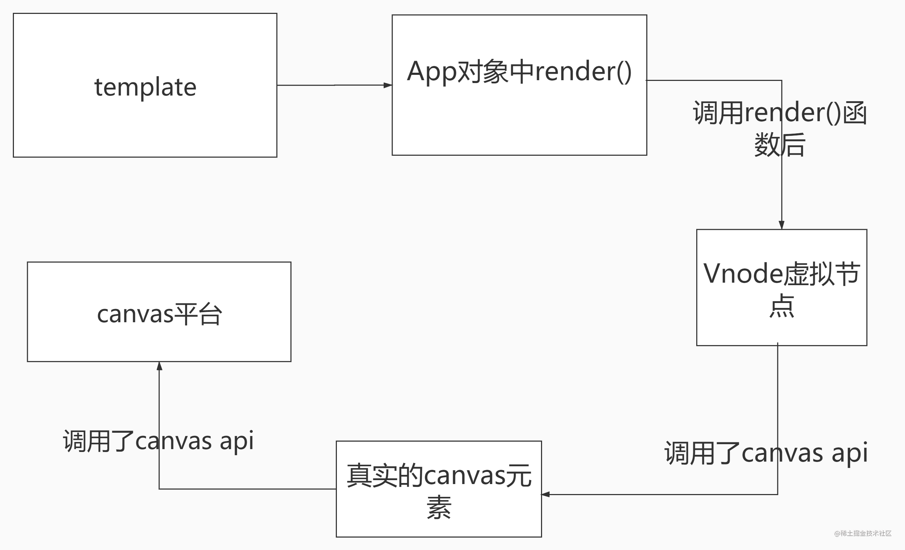

[[toc]]

## V3 新特性
  * [framents](#framents)
  * [Teleport](#Teleport)
  * [composition Api](#composition-api)
  * [createRenderer](#createRenderer)

### framents

  在 Vue3.x 中，组件现在支持有多个根节点
  ```html
  <!-- Layout.vue -->
  <template>
    <header>...</header>
    <main v-bind="$attrs">...</main>
    <footer>...</footer>
  </template>
  ```

### Teleport

  Teleport 是一种能够将我们的模板移动到 DOM 中 Vue app 之外的其他位置的技术，就有点像哆啦A梦的“任意门”

  在vue2中，像 modals,toast 等这样的元素，如果我们嵌套在 Vue 的某个组件内部，那么处理嵌套组件的定位、z-index 和样式就会变得很困难

  通过Teleport，我们可以在组件的逻辑位置写模板代码，然后在 Vue 应用范围之外渲染它
  ```html
  <button @click="showToast" class="btn">打开 toast</button>
  <!-- to 属性就是目标位置 -->
  <teleport to="#teleport-target">
      <div v-if="visible" class="toast-wrap">
          <div class="toast-msg">我是一个 Toast 文案</div>
      </div>
  </teleport>
  ```

### composition Api
    
  composition Api，也就是组合式api，通过这种形式，我们能够更加容易维护我们的代码，将相同功能的变量进行一个集中式的管理
  
    

  compositon api的使用，这里以下图展开
  
    

  简单使用:
  ```ts
  export default {
      setup() {
          const count = ref(0)
          const double = computed(() => count.value * 2)
          function increment() {
              count.value++
          }
          onMounted(() => console.log('component mounted!'))
          return {
              count,
              double,
              increment
          }
      }
  }
  ```

### createRenderer

  通过createRenderer，我们能够构建自定义渲染器，我们能够将 vue 的开发模型扩展到其他平台

  我们可以将其生成在[canvas画布](http://www.icodebang.com/article/309147.html)上
  

  基本使用
  1. 需要自己提供 nodeOpts，用于操作当前平台
  2. 需要重写mount，例如在重写的mount中创建的canvas节点，并挂载到#app上
  3. 挂载

  ```ts
  import { createRenderer } from '@vue/runtime-core'
  let ctx;
  let canvas;

  const nodeOpts = {
    patchProp,
    insert: (child, parent, anchor) => {
      //因为在我们的canvasApp中不存在实际dom插入操作，这里我们只需要将元素只见的父子关系保存一下即可。
      child.parent = parent
      if (!parent.childs) {
        parent.childs = [child]
      } else {
        parent.childs.push(child)
      }
      if (parent.nodeType === 1) {
        draw(child)
      }
    },
    remove,
    createElement: (tag, isSVG, is) => {
      //在内定义creteElement方法(创建Dom方法)，创建元素时由于没有需要创建的Dom元素，所以只需要返回当前元素的数据对象{tag}
      return {tag}
    },
    // ...
  }

  const { render, createApp } = createRenderer(nodeOpts)

  function createCanvasApp(App){
    const app = createApp(App)
    const mount = app.mount
    app.mount = function(selector){
      //创建canvas节点
      canvas = document.createElement('canvas');
      canvas.width = window.innerWidth;
      canvas.height = window.innerHeight;
      // 往selector上挂载 canvas节点
      document.querySelector(selector).appendChild(canvas);
      ctx = canvas.getContext('2d');
      // 将vnode生成的真实Dom（当前环境的节点）挂载
      mount(canvas)
    }
  }

  createCanvasApp({}).mount('#app')

  export { render, createApp }

  export * from '@vue/runtime-core'
  ```

### ref 、 reactive、 toRefs 、 toRef、 readonly
  1. ref：将基础类型的数据转为响应式的对象，该对象有唯一属性value指向原数据值；如果接受的是对象，会使人reactive来处理；
  2. reactive：将对象转为响应式的，并且是深度响应的；
  3. toRefs：将响应式对象转为普通对象，但其属性还是指向原响应式对象的属性的ref，即属性是响应式的；
  4. toRef：将响应式对象上的某个属性转为ref，然后这个ref就可被传递了，其保存对源对象的链接，即ref是响应式的；

  5. readonly：将对象或ref转为只读，并返回原始对象的只读代理。只读代理是深层的：任何被访问的嵌套 property 也是只读的。
  6. shallowRef：创建一个跟踪自身 .value 变化的 ref，但不会使其值也变成响应式的。
  7. triggerRef：手动执行与 shallowRef 关联的任何作用 (effect)。shallowRef处理的对象aa的属性变化不会被watchEffect监听到，需要triggerRef(aa)来手动执行才能触发；