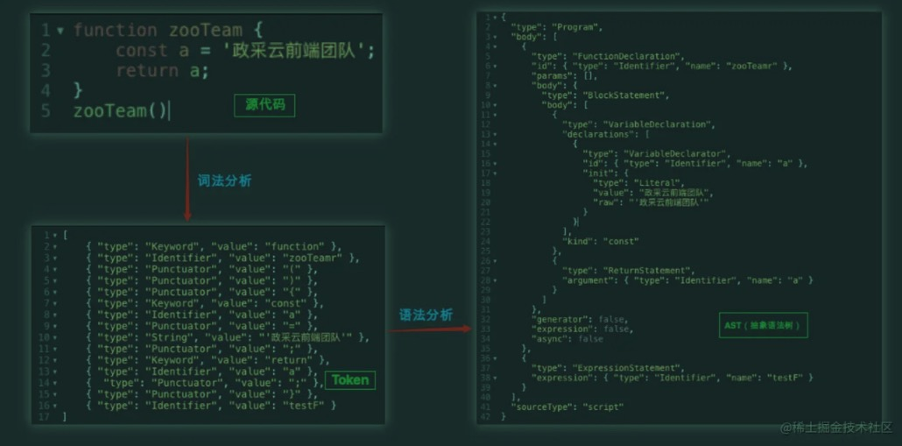
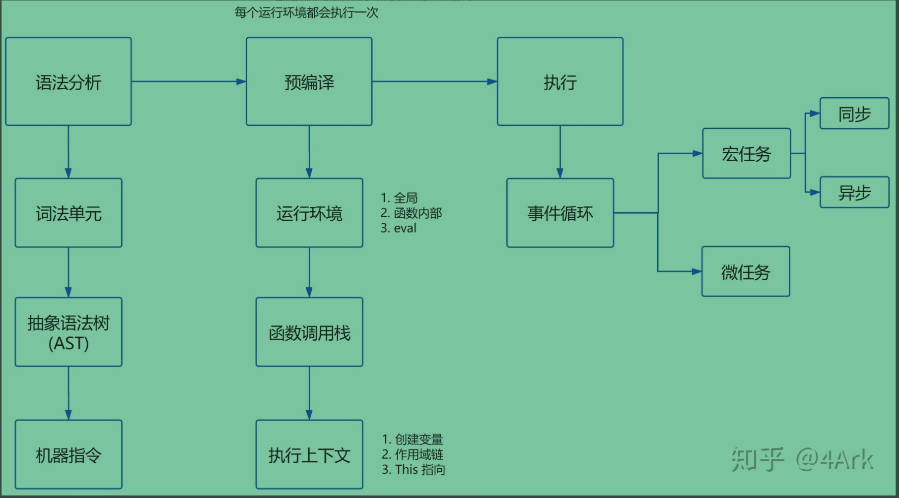
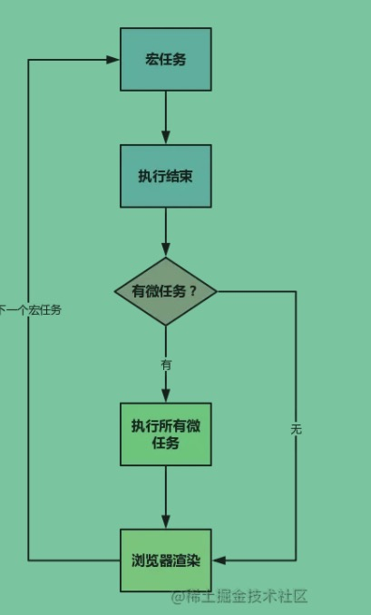

### JS解析与执行流程
#### 1. JS的解析阶段
  * 总结：代码 (词法分析)-> 词元token(语法分析) -> AST树(解释器转码) -> 机器码(JS引擎运行) 

      * JS是解释型预言，所以它无需提前编译，而是由解释器实时运行。
      JS引擎对JS解析过程，简介：
          1. 读取代码，进行词法分析(Lexical analysis)，将代码分解成词元(token)
          2. 对词元进行语法分析(parsing)，生成AST语法树(syntax tree)
          3. 使用解释器(translator)将代码转为字节码(bytecode)
          4. 使用字节码解释器(bytecode interpreter)，将字节码转为机器码
          
      最终计算机执行的就是机器码。
              <!-- https://juejin.cn/post/6971586506011967519 -->
              <!-- 
                JIT
                  为了提高运行速度，现代浏览器一般采用即时编译（JIT-Just In Time compiler）
                  即字节码只在运行时编译，用到哪一行就编译哪一行，并且把编译结果缓存（inline cache）
                  这样整个程序的运行速度能得到显著提升。
                  而且，不同浏览器策略可能还不同，有的浏览器就省略了字节码的翻译步骤，直接转为机器码（如chrome的v8）
                  总结起来可以认为是： 核心的JIT编译器将源码编译成机器码运行 
              -->

#### 2. JS的预处理阶段(具体处理事情)
  * 总结：预编译做了下面一件事情，即根据运行环境创建执行上下文(全局、函数、eval)，并压入执行栈
      1. 在正式执行JS前，还会有一个预处理阶段 （譬如变量提升，分号补全等）也叫预解析
      * 分号补全  
        列举几条自动加分号的规则：
          1. 当有换行符（包括含有换行符的多行注释），并且下一个token没法跟前面的语法匹配时，会自动补分号。
          2. 当有}时，如果缺少分号，会补分号。
          3. 程序源代码结束时，如果缺少分号，会补分号。
        eg:
          function b() {
            return
            {
                a: 'a'
            };
          }
          结果是 undefined
      
      * 变量提升
        譬如可以提下变量声明，函数声明，形参，实参的优先级顺序，以及es6中let有关的临时死区等
        <!-- 详情可见《作用域与上下文》篇 -->

      * 自执行函数：定义和执行一起完成
        自执行函数定义的那个function在全局作用域下不进行预解析，当代码执行到这个位置的时候，定义和执行一起完成了。
        eg:
          (function (num) {
            console.log(num);
          })(100);
        补充：其他定义自执行函数的方式
          ~ function (num) {}(100)  
          + function (num) {}(100)  
          - function (num) {}(100)  
          ! function (num) {}(100)  
      
      * return下的代码依然会进行预解析
        function fn() {                             
          console.log(num); // -> undefined
          return function () {             
                                        
          };                               
          var num = 100;                   
        }                                  
        fn();  
      
      * 名字已经声明过了，不需要重新的声明，但是需要重新的赋值
        var fn = 13;                                       
        function fn() {                                    
            console.log('ok');                               
        }                                                  
        fn(); // Uncaught TypeError: fn is not a function  \
          <!-- https://www.jianshu.com/p/c3276ff58c93 -->

#### 3. JS的执行阶段
  * 总结：执行栈执行上下文出入栈处理
  1. 大体执行流程：
      1. 浏览器首次载入脚本，它会创建全局上下文glo_context，全局上下文有this===VO===global属性，将glo_context压入执行堆栈顶端；
      2. 继续执行，遇到函数执行，创建对应的函数上下文fn_context，
          1. 初始化函数上下文的作用域链(复制fn在创建即定义时就创建的fn.[[Scopes]]属性到fn_context.Scope上)，即fn_context.Scope = [glo_context.VO],
          2. 初始化函数上下文的变量对象fn_context.VO(主要属性有：参数、函数声明、变量声明),创建arguments对象，实例化arguments对象获得arguments参数，扫描函数体获得函数声明，继续扫描函数体获得变量声明，至此，变量对象准备完成；
          3. 确定上下文的fn_context.this；
        将fn_context，压入执行堆栈顶端；
      3. 将fn_context.VO变量对象压入作用域链顶端，即fn_context.VO添加到 fn_context.Scope 的前端(fn_context.Scope = [fn_context.VO,glo_context.VO]);
      4. 执行函数fn，激活fn_context.VO，边执行边给fn_context.VO对象的属性赋值，最终变成fn_context.AO；此时的作用域链是这样的(fn_context.Scope = [fn_context.AO,glo_context.VO]);
      5. 执行完毕fn，从执行栈弹出(弹出后会涉及垃圾回收机制来释放内存)，将执行权交给新栈顶，最后交回给glo_context，执行完毕，glo_context弹出，至此，主执行栈清空完毕
      <!-- 下面是事件循环机制的内容，可以去《事件循环机制》篇看
      6. 主执行栈清空完毕，检查microtask队列，有任务压入主执行堆栈执行，直到microtask队列清空，检查macrotask队列进入下一个eventloop；
      7. 检查macrotask队列发现有任务，压入主执行堆栈执行，执行完一个，检查microtask队列，如此循环，直至所以队列清空。 -->
    
#### 4. 回收机制
  * 总结：执行栈每次弹出一个执行上下文都会进行垃圾回收，回收方式V8主要是分代式标记清除法
  1. 标记清除
      常用：01标记法，遍历根对象，有用的标1，最后清除所以0标记的；
      优点：标记简单，占内存小
      缺点：内存碎片化 、 分配速率低、 需每隔一段时间去遍历根对象，阻塞JS的执行
      V8 GC有优化：分代式优化，新老代区别对待
  2. 引用清除
      很少用了：引用类型，有引用的引用计数加1，为0的清除，
      优点：引用时就标记了，不用遍历
      缺点：循环引用问题(需要手动清除循环的对象)，维护一个计数器占内存
  <!-- 详情见《垃圾回收及内存泄漏》篇 -->

#### 5. 事件循环机制EventLoop
  * 总结：事件循环机制贯彻了整个JS脚本的执行过程
  1. 大体流程是：
      1. JS脚本加载完成，JS引擎生成一个执行栈，JS引擎解析、预编译脚本，产生全局执行上下文压入执行栈，即第一个MascroTask任务；
      2. 运行栈顶即全局执行上下文，当执行完成弹出执行栈，浏览器进行垃圾回收处理；
      3. 浏览器检查MiscroTask微任务队列，将任务压入执行栈，一个个执行后弹出，直到队列清空；
      4. 此时一个EventLoop循环执行完成，浏览器开始检查是否渲染，然后GUI线程接管渲染；
      5. 渲染完成，开启下一个EventLoop循环；
      6. 期间有用户交互、网络请求、JS脚本加载等，都会加入到MascroTask任务队列中去，等待下一个EventLoop来顺序执行它
  

### 总结：
  * 总流程可以通过EventLoop的流程来贯彻。
  