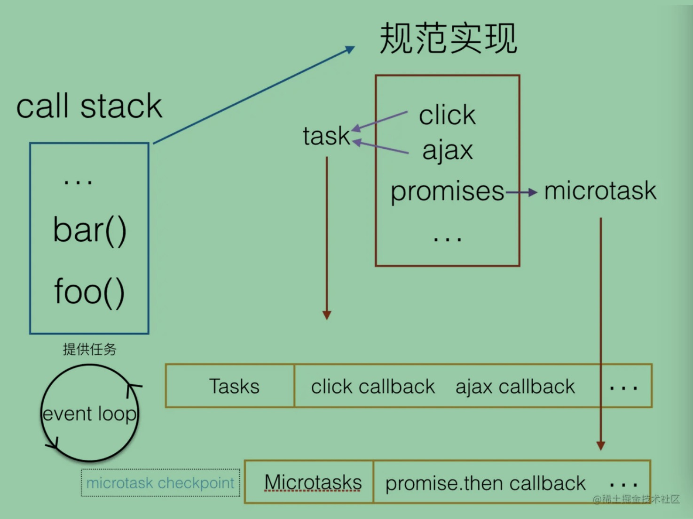
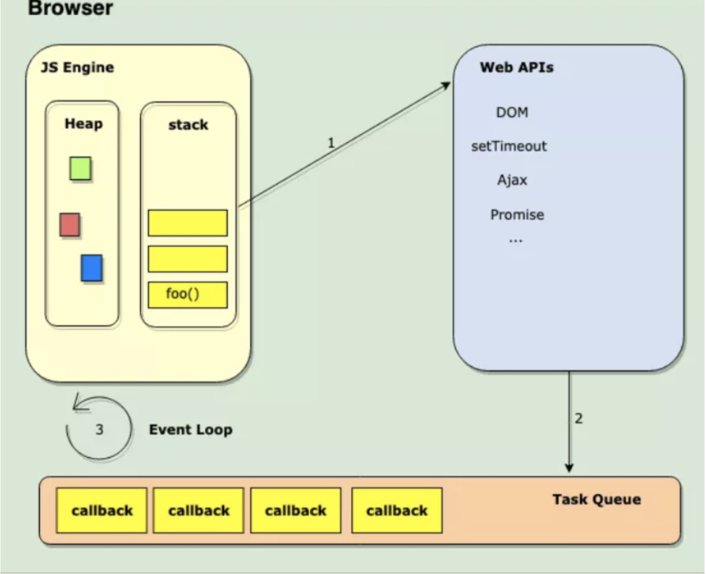

### Event Loop
  1. 介绍：
    Event loop,是在HTML Standard中的定义的，ECMAScript中并没有event loops的概念。
      项目中为了协调事件，用户交互，脚本，渲染，网络等，用户代理必须使用event loop。
      事件，用户交互，脚本，渲染，网络这些都是我们所熟悉的东西，他们都是由event loop协调的。触发一个click事件，进行一次ajax请求，背后都有event loop在运作。
      

  2. 执行栈 (先进后出)
    1. MacroTask和MicroTask的任务都是推入栈中执行的！！！
    2. 执行栈里存入的都是 执行上下文 (可能是浏览器上下文、函数上下文)
      javaScript是单线程，也就是说只有一个主线程，主线程有一个栈，每一个函数执行的时候，都会生成新的execution context (执行上下文 )，执行上下文会包含一些当前函数的参数、局部变量之类的信息，它会被推入栈中， running execution context (正在执行的上下文 )始终处于栈的顶部。当函数执行完后，它的执行上下文会从栈弹出。

  3. MacroTask(Task) 宏观队列 (先进先出) (事件触发线程维护)
      1. 一个Event loop 有一个 或者 多个Task队列。
      2. 当用户代理安排一个任务，必须将该任务增加到相应的event loop的一个task队列中。
      3. 每一个Task都来源于指定的任务源，比如可以为鼠标、键盘事件提供一个task队列，其他事件又是一个单独的队列。可以为鼠标、键盘事件分配更多的时间，保证交互的流畅。
          * Task任务源：
            1. DOM操作任务源：此任务源被用来相应dom操作，例如一个元素以非阻塞的方式插入文档。
            2. 用户交互任务源：此任务源用于对用户交互作出反应，例如键盘或鼠标输入。响应用户操作的事件 (例如click )必须使用task队列。
            3. 网络任务源：网络任务源被用来响应网络活动。
            4. history traversal任务源：当调用history.back()等类似的api时，将任务插进task队列。
            eg:
              setTimeout(setTimeout的4ms标准化了)
              setInterval
              setImmediate
              I/O
              UI rendering
            包括：script代码块，MessageChannel，requestAnimationFrame，setTimeout，setInterval；

      4. 再根据线程来理解下：Macrotask中的事件都是放在一个事件队列中的，而这个队列由事件触发线程维护

  4. MicroTask (jobs) 微观队列 (先进先出) (JS引擎线程维护)
      1. 每一个event loop都有一个microtask队列，一个microtask会被排进microtask队列而不是task队列。
      2. 有两种microtasks：分别是solitary callback microtasks和compound microtasks。
          规范值只覆盖solitary callback microtasks。
      3. 如果在初期执行时，spin the event loop，microtasks有可能被移动到常规的task队列，
          在这种情况下，microtasks任务源会被Macrotask任务源所用。通常情况，Macrotask任务源和microtasks是不相关的。

      异同：
        都是 (先进先出 )
        不同的是一个event loop里只有一个microtask 队列。

      eg:
        process.nextTick
        promises
        Object.observe
        MutationObserver

      4. 再根据线程来理解下：Microtask中的所有微任务都是添加到微任务队列（Job Queues）中，等待当前macrotask执行完毕后执行，而这个队列由JS引擎线程维护

  5. Event Loop 深入理解
      1. 两种event loops，
        1. 在浏览器上下文
        2. 在workers中
      
      2. 浏览器上下文 
        1. 每一个用户代理必须至少有一个浏览器上下文event loop，但是每个单元的相似源浏览器上下文至多有一个event loop。
        2. event loop 总是具有至少一个浏览器上下文，当一个event loop的浏览器上下文全都销毁的时候，event loop也会销毁。
            一个浏览器上下文总有一个event loop去协调它的活动。
        3. Worker的event loop相对简单一些，一个worker对应一个event loop，worker进程模型管理event loop的生命周期。

      3. 何为浏览器上下文？
        浏览器上下文是一个将 Document 对象呈现给用户的环境。在一个 Web 浏览器内，一个标签页或窗口常包含一个浏览上下文，如一个 iframe 或一个 frameset 内的若干 frame。

      4. 其他
        1. 每个线程都有自己的event loop。
        2. 浏览器可以有多个event loop，browsing contexts和web workers就是相互独立的。
        3. 所有同源的browsing contexts可以共用event loop，这样它们之间就可以相互通信。

      5. Event loop的处理过程 (Processing model )
          在规范的Processing model定义了event loop的循环过程：
            一个event loop只要存在，就会不断执行下边的步骤：
              1. 执行一个宏任务（栈中没有就从事件队列中获取）
              2. 执行过程中如果遇到微任务，就将它添加到微任务的任务队列中
              3. 宏任务执行完毕后，立即执行当前微任务队列中的所有微任务（依次执行）
              4. 当前宏任务执行完毕，开始检查渲染，然后GUI线程接管渲染
              5. 渲染完毕后，JS线程继续接管，开始下一个宏任务（从事件队列中获取）
            <!-- 参考文章：https://juejin.cn/post/6844903553795014663 -->

            <!-- 1. 在tasks队列中选择最老的一个task,用户代理可以选择任何task队列，如果没有可选的任务，则跳到下边的microtasks步骤。 
            2. 将上边选择的task设置为正在运行的task。 
            3. Run: 运行被选择的task。        
            4. 将event loop的currently running task变为null。 
            5. 从task队列里移除前边运行的task。 
            6. Microtasks: 执行microtasks任务检查点。 (也就是执行microtasks队列里的任务 )        
            7. 更新渲染 (Update the rendering )... 
            8. 如果这是一个worker event loop，但是没有任务在task队列中，并且WorkerGlobalScope对象的closing标识为true，则销毁event loop，中止这些步骤，然后进行定义在Web workers章节的run a worker。 
            9. 返回到第一步。 -->

          event loop会不断循环上面的步骤，概括说来：
            1. event loop会不断循环的去取tasks队列的中最老的一个任务推入 执行栈 中执行，并在当次循环里依次执行并清空microtask队列里的任务。
            2. 执行完microtask队列里的任务，有可能会渲染更新。 (浏览器很聪明，在一帧以内的多次dom变动浏览器不会立即响应，而是会积攒变动以最高60HZ的频率更新视图 )
      
  6. event loop的 更新渲染(Update the rendering)
      规范允许浏览器自己选择是否更新视图。也就是说可能不是每轮事件循环都去更新视图，只在有必要的时候才更新视图。
      渲染的基本流程：
        1. 处理 HTML 标记并构建 DOM 树。
        2. 处理 CSS 标记并构建 CSSOM 树， 将 DOM 与 CSSOM 合并成一个渲染树。
        3. 根据渲染树来布局，以计算每个节点的几何信息。
        4. 将各个节点绘制到屏幕上。
      注意： 可以看到渲染树的一个重要组成部分是CSSOM树，绘制会等待css样式全部加载完成才进行，所以css样式加载的快慢是首屏呈现快慢的关键点。

      小结：
        1. 在一轮event loop中多次修改同一dom，只有最后一次会进行绘制。
        2. 渲染更新 (Update the rendering )会在event loop中的tasks和microtasks完成后进行，但并不是每轮event loop都会更新渲染，这取决于是否修改了dom和浏览器觉得是否有必要在此时立即将新状态呈现给用户。如果在一帧的时间内 (时间并不确定，因为浏览器每秒的帧数总在波动，16.7ms只是估算并不准确 )修改了多处dom，浏览器可能将变动积攒起来，只进行一次绘制，这是合理的。
        3. 如果希望在每轮event loop都即时呈现变动，可以使用requestAnimationFrame。
        4. postMessage属于task，因为setTimeout的4ms标准化了，所以这里的postMessage会优先setTimeout运行。

  <!-- 参考文章：https://juejin.cn/post/6844903476527366151 -->

### EventLoop过程叙述　　
  
　　当我们说“浏览器是 JS 的家”时，这句话真正的意思是浏览器提供运行时环境来执行我们的JS代码。

　　浏览器的主要组件包括JS引擎，事件循环，任务队列和Web APIs。上图的任务队列有一点瑕疵，任务队列应该有两个（宏任务队列与微任务队列）。

　　JS引擎从堆中取出JS代码并及进行分析。假设是一段或多段script代码，它会被认为是一个或几个宏任务，并推入到web apis中。web apis看到是script代码，就把它推入到宏任务队列中，event loop从宏任务队列取到这一段JS代码，并放入执行栈中执行。

　　在执行当前宏任务时，每当它遇到一些异步代码，如setTimeout，它又会把它推入到web apis中去执行。当异步代码在Web APIs被执行完后，其回调callback 就被送往任务队列。

　　event loop不断地监视任务队列(Task Queue)，并按它们排队的顺序一次处理一个回调。每当调用栈为空，也就是同步代码执行完毕时，event loop会不断地去微任务队列里取任务放到执行栈执行，当微任务队列被清空时，才去宏任务队列取任务执行。请记住，如果调用栈不是空的，则事件循环不会将任何回调推入执行栈。
  <!-- 参考文章：http://t.zoukankan.com/zhangnan35-p-11268655.html -->