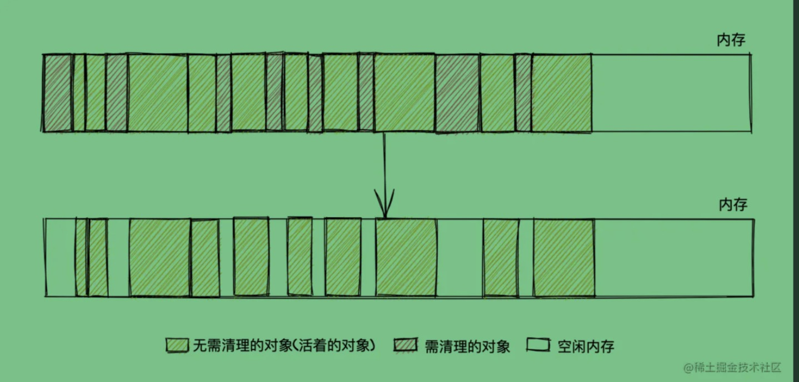
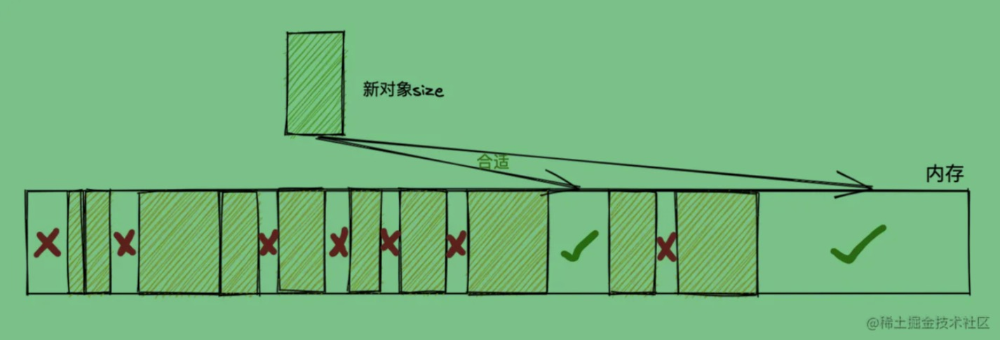
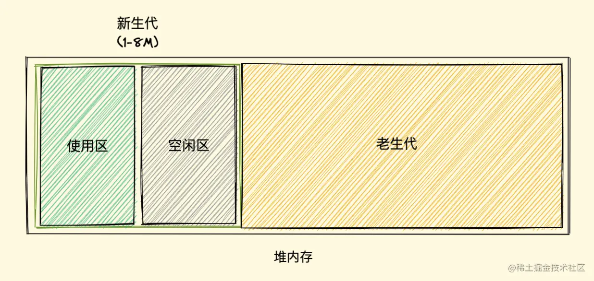
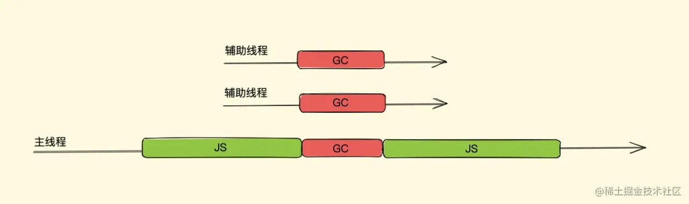

### JS垃圾回收机制
  JS有垃圾处理器，所以无需手动回收内存，而是由垃圾处理器自动处理。
  * 没有使用的内存及时释放，一般来说，垃圾处理器有自己的回收策略。
  * 回收时机：譬如对于那些执行完毕的函数，如果没有外部引用（被引用的话会形成闭包），则会回收。（当然一般会把回收动作切割到不同的时间段执行，防止影响性能）
  <!-- 
    这里可能需要简单介绍下，强弱引用，我们先来说强引用，之前我们说 JS 的垃圾回收机制是如果我们持有对一个对象的引用，那么这个对象就不会被垃圾回收，这里的引用，指的就是 强引用 ，而弱引用就是一个对象若只被弱引用所引用，则被认为是不可访问（或弱可访问）的，因此可能在任何时刻被回收。 
  -->

  1. GC是什么
    GC 即 Garbage Collection ，程序工作过程中会产生很多 垃圾，这些垃圾是程序不用的内存或者是之前用过了，以后不会再用的内存空间，而 GC 就是负责回收垃圾的，因为他工作在引擎内部，所以对于我们前端来说，GC 过程是相对比较无感的，这一套引擎执行而对我们又相对无感的操作也就是常说的 垃圾回收机制 了
    当然也不是所有语言都有 GC，一般的高级语言里面会自带 GC，比如 Java、Python、JavaScript 等，也有无 GC 的语言，比如 C、C++ 等，那这种就需要我们程序员手动管理内存了，相对比较麻烦

  2. 常用的两种垃圾回收规则是：
      1. 标记清除
          1. Javascript引擎基础GC方案是（simple GC）：Mark-Sweep（标记清除），简单解释如下：
            1. 遍历所有可访问的对象。
            2. 回收已不可访问的对象。

          <!-- 
            引擎在执行 GC（使用标记清除算法）时，需要从出发点去遍历内存中所有的对象去打标记，而这个出发点有很多，我们称之为一组 根 对象，而所谓的根对象，其实在浏览器环境中包括又不止于 全局Window对象、文档DOM树 等 
          -->

          2. 整个标记清除算法大致过程就像下面这样
            1. 初始: 垃圾收集器在运行时会给内存中的所有变量都加上一个标记，假设内存中所有对象都是垃圾，全标记为0
            2. 标记: 然后从各个根对象开始遍历，把不是垃圾的节点改成1
            3. 清除: 清理所有标记为0的垃圾，销毁并回收它们所占用的内存空间
            4. 回归: 最后，把所有内存中对象标记修改为0，等待下一轮垃圾回收

          3. 优点
            标记清除算法的优点只有一个，那就是实现比较简单，打标记也无非打与不打两种情况，这使得一位二进制位（0和1）就可以为其标记，非常简单

          4. 缺点
              <!-- 
                标记清除算法有一个很大的缺点，
                1. 就是在清除之后，剩余的对象内存位置是不变的，也会导致空闲内存空间是不连续的，出现了 内存碎片（如下图Mark-Sweep-bug1.jpg），并且由于剩余空闲内存不是一整块，它是由不同大小内存组成的内存列表，这就牵扯出了内存分配的问题
                2.假设我们新建对象分配内存时需要大小为 size，由于空闲内存是间断的、不连续的，则需要对空闲内存列表进行一次单向遍历找出大于等于 size 的块才能为其分配（如下图Mark-Sweep-bug2.jpg） 
              -->
              那如何找到合适的块呢？我们可以采取下面三种分配策略
                1. First-fit，找到大于等于 size 的块立即返回
                2. Best-fit，遍历整个空闲列表，返回大于等于 size 的最小分块
                3. Worst-fit，遍历整个空闲列表，找到最大的分块，然后切成两部分，一部分 size 大小，并将该部分返回
                这三种策略里面 Worst-fit 的空间利用率看起来是最合理，但实际上切分之后会造成更多的小块，形成内存碎片，所以不推荐使用，对于 First-fit 和 Best-fit 来说，考虑到分配的速度和效率 First-fit 是更为明智的选择
              综上所述，标记清除算法或者说策略就有两个很明显的缺点
                1. 内存碎片化，空闲内存块是不连续的，容易出现很多空闲内存块，还可能会出现分配所需内存过大的对象时找不到合适的块
                2. 分配速度慢，因为即便是使用 First-fit 策略，其操作仍是一个 O(n) 的操作，最坏情况是每次都要遍历到最后，同时因为碎片化，大对象的分配效率会更慢
                
              PS：标记清除算法的缺点补充
                归根结底，标记清除算法的缺点在于清除之后剩余的对象位置不变而导致的空闲内存不连续，所以只要解决这一点，两个缺点都可以完美解决了 
              * 标记整理（Mark-Compact）算法 就可以有效地解决，它的标记阶段和标记清除算法没有什么不同，只是标记结束后，标记整理算法会将活着的对象（即不需要清理的对象）向内存的一端移动，最后清理掉边界的内存（如下图）
              
              

          
      2. 引用计数
          1. 策略
            引用计数（Reference Counting），这其实是早先的一种垃圾回收算法，它把 对象是否不再需要 简化定义为 对象有没有其他对象引用到它，如果没有引用指向该对象（零引用），对象将被垃圾回收机制回收，目前很少使用这种算法了，因为它的问题很多，不过我们还是需要了解一下
            它的策略是跟踪记录每个变量值被使用的次数
              1. 当声明了一个变量并且将一个引用类型赋值给该变量的时候这个值的引用次数就为 1
              2. 如果同一个值又被赋给另一个变量，那么引用数加 1
              3. 如果该变量的值被其他的值覆盖了，则引用次数减 1
              4. 当这个值的引用次数变为 0 的时候，说明没有变量在使用，这个值没法被访问了，回收空间，垃圾回收器会在运行的时候清理掉引用次数为 0 的值占用的内存

          2. 例子
                let a = new Object() 	// 此对象的引用计数为 1（a引用）
                let b = a 		// 此对象的引用计数是 2（a,b引用）
                a = null  		// 此对象的引用计数为 1（b引用）
                b = null 	 	// 此对象的引用计数为 0（无引用）
                ...			// GC 回收此对象
              这种方式是不是很简单？确实很简单，不过在引用计数这种算法出现没多久，就遇到了一个很严重的问题——循环引用，即对象 A 有一个指针指向对象 B，而对象 B 也引用了对象 A ，如下面这个例子
                function test(){
                  let A = new Object()
                  let B = new Object()
                  A.b = B
                  B.a = A
                }

                如上所示，对象 A 和 B 通过各自的属性相互引用着，按照上文的引用计数策略，它们的引用数量都是 2，但是，在函数 test 执行完成之后，对象 A 和 B 是要被清理的，但使用引用计数则不会被清理，因为它们的引用数量不会变成 0，假如此函数在程序中被多次调用，那么就会造成大量的内存不会被释放
                
                我们再用标记清除的角度看一下，当函数结束后，两个对象都不在作用域中，A 和 B 都会被当作非活动对象来清除掉，相比之下，引用计数则不会释放，也就会造成大量无用内存占用，这也是后来放弃引用计数，使用标记清除的原因之一

          3. 优点
              引用计数算法的优点我们对比标记清除来看就会清晰很多，首先引用计数在引用值为 0 时，也就是在变成垃圾的那一刻就会被回收，所以它可以立即回收垃圾
              而标记清除算法需要每隔一段时间进行一次，那在应用程序（JS脚本）运行过程中线程就必须要暂停去执行一段时间的 GC，另外，标记清除算法需要遍历堆里的活动以及非活动对象来清除，而引用计数则只需要在引用时计数就可以了

          4. 缺点
              引用计数的缺点想必大家也都很明朗了，首先它需要一个计数器，而此计数器需要占很大的位置，因为我们也不知道被引用数量的上限，还有就是无法解决循环引用无法回收的问题，这也是最严重的

  3. V8对GC的优化
      我们在上面也说过，现在大多数浏览器都是基于标记清除算法，V8 亦是，当然 V8 肯定也对其进行了一些优化加工处理，那接下来我们主要就来看 V8 中对垃圾回收机制的优化
      1. 分代式垃圾回收
          试想一下，我们上面所说的垃圾清理算法在每次垃圾回收时都要检查内存中所有的对象，这样的话对于一些大、老、存活时间长的对象来说同新、小、存活时间短的对象一个频率的检查很不好，因为前者需要时间长并且不需要频繁进行清理，后者恰好相反，怎么优化这点呢？？？分代式就来了。
          * 总结：为了解决标记算法的每次都要检查整个对象，而对于大、老、存活时间长的对象是不需要经常检查的问题，js V8 引擎进行了优化策略。 

      2. 新生代 和 老生代
          
          * 将内存分块，新生代内存(1~8M),剩余的是老生代
            1. 新生代：新的存活时间短的对象
            2. 老生代：存活时间长，经历过新生代垃圾回收机制还存活下来的对象

          * 对于 新生代 和 老生代 ，V8 分别进行了不同的垃圾回收机制
            1. 新生代 垃圾回收：
              1. 概念：
                通过一个名为 Scavenge 的算法进行垃圾回收，在 Scavenge算法 主要采用了一种复制式的方法，即 Cheney算法，Cheney算法 中将堆内存一分为二，一个是处于使用状态的空间我们暂且称之为 使用区，一个是处于闲置状态的空间我们称之为 空闲区
              2. 回收过程：
                1. 触发条件：新加入的对象都会存放到使用区，当使用区快被写满时，就需要执行一次垃圾清理操作
                2. 开始垃圾回收阶段，对使用区的活动对象进行标记，标记完成后将使用区活动对象复制到空闲区并排序，
                3. 随后进行垃圾清理阶段，将使用区非活动对象占用的空间进行清理，
                4. 最后角色互换，使用区变成空闲区，空闲区变成使用区。
              3. 存入老生代：
                * 当一个对象在新生代进行了多次垃圾回收处理还存活，将被移到老生代去
                * 当复制到空闲区的活动对象占比超过25%，将被认为过大对象，也将直接移到老生代去
                
            2. 老生代 垃圾回收：
              * 由于老生代对象都是比较大的，所以不适合使用Scavenge算法来进行复制操作，直接使用标记算法来清理
              1. 标记阶段：遍历一组根对象，可达元素被标记为活动对象，不可达的为非活动对象
              2. 清理阶段：清理所有非活动对象
              3. 优化空间：整理内存碎片

      3. 增加回收效率
          1. 新生代 的 并行回收
            1. 并行回收(Parallel)
              * 如有js是单线程的，即js的垃圾回收机制会阻塞js脚本的执行，这过程叫做 全停顿
              * 为解决全停顿问题，采用 并行回收 机制，来减少停顿时间：
                在新生代垃圾回收过程中，会开启多线程来清理，这些线程同时将对象空间中的数据移动到空闲区域，这个过程中由于数据地址会发生改变，所以还需要同步更新引用这些对象的指针，此即并行回收
                <!-- ？？？没太明白 -->
                
                
          * 并行回收对于新生代是够的，但是对老生代里的大内存来说，阻塞时间还是很长的，为此出现下面的几种方案：
          2. 老生代 的 并行回收、增量标记、惰性清理、并发回收 
            <!-- 
              多种融合使用，主要是并发标记，主线程执行js时，辅助线程进行标记，标记完后，主线程清理同时，辅助线程也进行清理操作，
              同时，清理的任务会采用增量的方式分批在各个 JavaScript 任务之间执行。 
            -->
            1. 增量标记
                * 即将一次GC标记过程分为多次来处理，一次GC阻塞过长，那么分多次，卡顿效果就相对无感知，虽然时间是一样长的
                * 分多次处理，如何暂停 和 恢复上一次的处理呢？
                1. 三色标记法：
                  <!-- * 0 和 1 的标记法是单色，即黑白色标记法 -->
                  1. 白色：未被标记的对象
                  2. 灰色：自身标记了，但成员变量(该对象的引用对象)未被标记
                  3. 黑色：自身和成员变量都被标记
                2. 标记过程：
                  1. 最初所有对象都是白色的，从根组对象开始，将根组对象都标记为灰色，并推入标记工作表中，
                  2. 当回收器弹出对象并访问对象的引用对象时，将其自身标记为黑色，并将其自身的下一个引用对象标记为灰色
                  3. 如此走下去，当没有可标记为灰色对象时，即无可达对象了，那么剩下的对象都是白色
                3. 暂停 与 恢复
                  1. 采用三色标记法，标记的对象，当恢复时，可判断是否有灰色标记对象来判断整个标记是否完成
                  2. 如果没有灰色，那么进入清理阶段，如果有灰色，从灰色节点开始继续标记

                * 如果标记过程中，暂停后执行js脚本，黑色对象被改写了，之前的黑色对象失去引用(那么此轮GC不会清除它，但是下轮会，因为下轮执行开始全为白色)，新的对象被标为白色，这是错误的，如何解决？
                * 写屏障：
                  1. 当黑色对象引用白色对象时，会强制将白色对象改为灰色对象

            2. 惰性清理
                * 增量标记其实只是对活动对象和非活动对象进行标记，对于真正的清理释放内存 V8 采用的是惰性清理(Lazy Sweeping)
                1. 增量标记完成后，惰性清理就开始了。
                2. 当增量标记完成后，假如当前的可用内存足以让我们快速的执行代码，其实我们是没必要立即清理内存的，可以将清理过程稍微延迟一下，让 JavaScript 脚本代码先执行，也无需一次性清理完所有非活动对象内存，可以按需逐一进行清理直到所有的非活动对象内存都清理完毕，后面再接着执行增量标记

            3. 并发回收(Concurrent)
                * 增量标记并没有减少阻塞时间，只是无感知清理，同时反而增加了整体阻塞时间，降低应用的吞吐量
                辅助线程在执行垃圾回收的时候，主线程也可以自由执行而不会被挂起，这是并发的优点，但同样也是并发回收实现的难点，因为它需要考虑主线程在执行 JavaScript  时，堆中的对象引用关系随时都有可能发生变化，这时辅助线程之前做的一些标记或者正在进行的标记就会要有所改变，所以它需要额外实现一些读写锁机制来控制这一点

      4. 总结：
        1. 大部分浏览器使用标记清除法，但标记清除每次都遍历整个根对象会相对耗时，V8进行了优化，使用分代式垃圾回收机制来处理；
        分代式垃圾回收分新老代回收机制，新生代存放新、小、短时间的对象，
        2. 并且在新生代回收机制中利用scavenge算法分为了使用区和空闲区，将使用区的活动对象复制给空闲区并排序，清除使用区非活动对象，然后角色互换，从而保证使用区的对象是有序且活动的；同时为了提升新生代的回收效率，V8采用并行回收来处理新生代的回收效率；
        3. 老生代存放的是大、老、长时间的对象，不适合scavenge算法，使用普通标记来处理即可；同时为了提升老生代的回收效率，V8提高了几种方案：并行回收、增量标记、惰性清理、并发回收，主要还是并发回收，因为这个不阻塞js脚本执行；但同时也会使用其他方案，比如并行回收配合增量标记使用三色标记法来标记暂停和恢复时期，再配合惰性清理来减少回收次数。
        
### 总结：
  1. JS的垃圾回收机制主要有两种：
    1. 标记清除
        1. 标记清除的原理是初始时将所有变量默认标为0即垃圾，当运行完代码，遍历根对象组，将可访问的对象标记为1，标记完后开始清除，清除标记为0的变量；
        2. 标记清除的优点就是标记简单01，缺点是需要经常去遍历根对象清除垃圾，清除后的内存也是不连续的；
        3. V8采用的就是标记清除机制
            1. V8的标记将内存分为两份新生代内存存放新、小、存活短的数据，老生代存放老、大、长时间的数据
            2. 新生代的标记方法是将内存一分为二，分为使用区和空闲区，当使用区的使用内存快满时，开启垃圾回收机制，开始标记时在使用区标记，将活动对象标记为1，非活动对象标记为0，然后将标记为1的拷贝到空闲区并排序，清除使用区标记为0的数据，互换使用区和空闲区，此时使用区的都是活动对象并且是有序的
            3. 当新生代的对象进过多次清理后还在，就放入老生代，或复制到空闲区的数据大于25%的内存直接放老生代
            4. 老生代的标记方法是普通的标记清除法，但是为了提供清除性能，主要采用增加辅助线程，进行并发回收方法
            5. 老生代同样可以采用增量标记来提升性能，即执行一段代码，清除一下，采用三色标记法来暂停继续清除，默认全部为白色，根组对象标记为灰色，全部标记完标记为黑色，将其子引用对象标记为灰色，没有灰色可标记时回收所有白色的；继续时看是否有灰色，有继续标记，没有回收所有白色，清除完成

    2. 引用计数
        1. 主要针对引用类型的数据结构，维护一个计数器，数据被引用一次计数加一，被取消引用则减一，当引用计数为0时，清除该数据内存；
        2. 引用计数优点就是引用为0时就清除，不用每次去遍历根对象，缺点就是需要维护一个计数器，本身就占内存

<!-- 「硬核JS」你真的了解垃圾回收机制吗
https://juejin.cn/post/6981588276356317214 -->